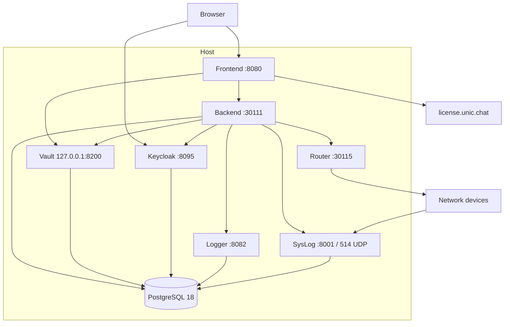
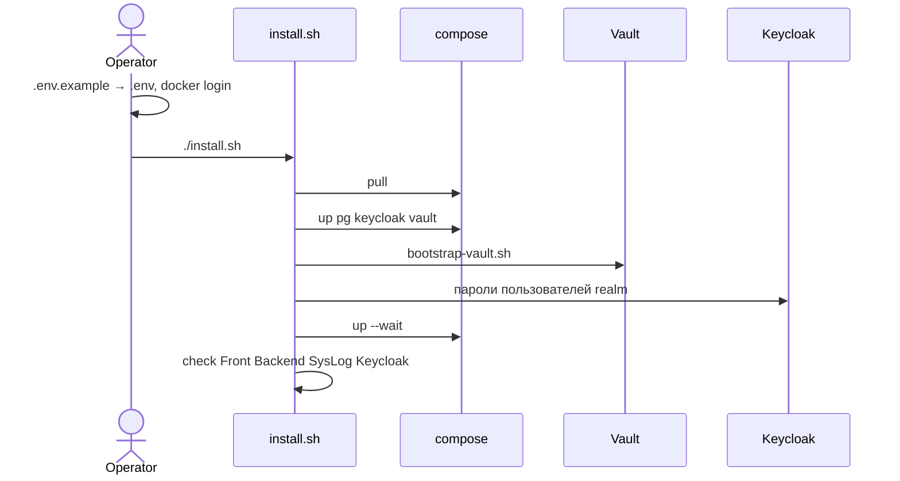

# Первоначальное развёртывание UnicNet

Один Linux-хост, Docker Engine 24+, Compose v2. Рабочий каталог — корень репозитория (на стенде `/opt/unicnet.enterprise`).

`install.sh` поднимает стек. Он **не** создаёт `.env` и **не** логинится в Yandex Container Registry. Это делают руками, затем запускают скрипт.

MongoDB и RabbitMQ в этой поставке нет. Данные — PostgreSQL 18. Секреты приложений — Unic.Vault. Лицензия Front/Backend/Router — JWT в `.env` (`UNIC_LICENSE_DATA`).

Диаграммы: [architecture.svg](diagrams/architecture.svg), исходники [architecture.mmd](diagrams/architecture.mmd) и [install-flow.mmd](diagrams/install-flow.mmd).

## Архитектура



Клиентам Vault в compose передаются только `Vault__Url` и параметры подписи JWT. PostgreSQL и Vault получают bootstrap из `.env`. Исключение: JWT лицензии пробрасывается в Front, Backend и Router как `UniCommLicenseData` (у Router ещё `Router__License__Data`).

Realm `unicnet` уже в `keycloak-import/unicnet-realm.json`: клиент `FrontUiV2`, группы `unicnet_admin_group` / `unicnet_superuser_group` / `unicnet_user_group`, пользователь `unicadmin`. Паролей в JSON нет.

Образы: `pg:18`, `keycloak:26.7.0`, приложения `20260825-767ceff843ca` (`UNICNET_IMAGE_TAG`). Плавающий тег `prod` для первого запуска не используйте.

Не коммитьте `.env`, `vault-values.json`, `.keycloak-passwords`, `.unicadmin-password`, токены YCR.

## Порядок установки

Совпадает с `./install.sh --help`.

### 1. Заполнить `.env.example`

Нужны Docker (группа `docker`), `curl`, `jq`, `python3`.

Правите **`.env.example`**, не создавая `.env` заранее. Не оставляйте `replace_*`.

| Переменная | Назначение |
|---|---|
| `POSTGRES_*` | БД, пользователь, пароль. В Vault уйдут с `Host=pg` |
| `KEYCLOAK_ADMIN`, `KEYCLOAK_ADMIN_PASSWORD` | Админ realm `master` |
| `KEYCLOAK_PUBLIC_URL` | `http://<ip-хоста>:8095` — и браузер, и Backend/Router. Не `localhost`, если заходят с другой машины |
| `VAULT_JWT_SIGNING_KEY` | ≥ 32 символов: `openssl rand -base64 48` |
| `VAULT_JWT_ISSUER` | `UniComm PRO Software` |
| `UNIC_LICENSE_DATA` | JWT, начинается с `eyJ`. `GET https://license.unic.chat/api/lic` с Bearer должен дать 200 |
| `API_LICENSE_URL` | `https://license.unic.chat/` |
| `ROUTER_CIDR` | Сеть хоста, например `10.0.26.0/24` |

Старый Solid-блоб `UnicLicense` Front не принимает.

### 2. Скопировать env

```bash
cp .env.example .env
chmod 600 .env
```

Если `.env` нет или в нём `replace_*`, скрипт останавливается и ничего не дописывает.

### 3. Войти в registry вручную

У того же пользователя, от которого пойдёт compose:

```bash
docker login --username iam --password-stdin cr.yandex <<<"$YC_IAM_TOKEN"
# или
docker login --username oauth --password-stdin cr.yandex
```

### 4. Запустить скрипт

```bash
chmod +x install.sh bootstrap-vault.sh
./install.sh
```



Что делает скрипт:

1. Проверяет `.env` (в том числе JWT и `ROUTER_CIDR`).
2. Собирает `vault-values.json` из примера и `.env`, если файла ещё нет.
3. `docker compose pull`.
4. Поднимает `pg`, `keycloak`, `vault`.
5. Грузит секреты в Vault. Токен Vault — raw JWT, не JSON; через `jq` его нельзя прогонять.
6. Для каждого пользователя из realm JSON пишет пароль в `.keycloak-passwords` (unicadmin дублируется в `.unicadmin-password`). Повторный запуск уже записанные пароли не меняет.
7. Поднимает весь граф `--wait`.
8. Проверяет Front `:8080`, Backend `:30111/health/ready`, SysLog `:8001/health/live`, Keycloak realm. **Не** вызывает `:30115/health/ready` — это рвёт WSS Router.

Флаги: `--skip-pull`, `--render-vault`, `--skip-unicadmin`, `--only=core|vault|unicadmin|stack|check`.

После успеха UI `http://<host>:8080/` — `unicadmin`, пароль в `.keycloak-passwords`. Админка Keycloak `:8095` — учётка из `.env`.

## Обновление лицензии

Вписать JWT в `.env.example`, снова `cp .env.example .env` (или поправить `.env`), затем:

```bash
./install.sh --render-vault --skip-pull
```

Лицензия продукта не умеет `/api/lic/new` и `/api/lic/all` (403). Баннер «Отсутствует активная лицензия» при живом JWT: сервер не знает id или в токене только модули `uc.*`.

## Обновление образов

Сменить `UNICNET_IMAGE_TAG` в `.env.example`, скопировать в `.env`, `./install.sh`. Откат — предыдущий тег. Данные в volume `unicnet_postgres-data`; перед обновлением `pg_dump`.

## Сборка образов

```bash
docker build --provenance=false -f UnicNet/UnicNet.Backend/Dockerfile .
```

Backend, Frontend, Router, SysLog — context `UniComm.app`; Logger и Vault — `UnicSharedLib`.
