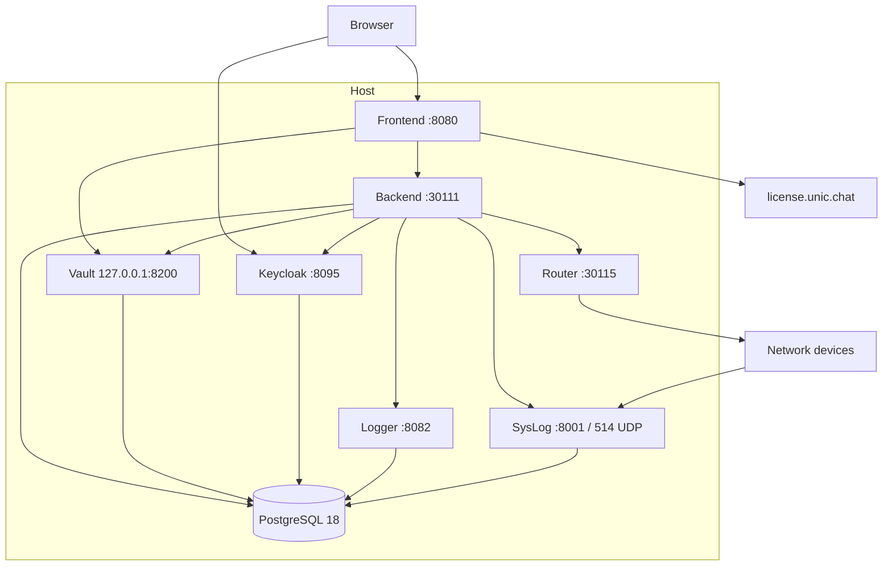

# Первоначальное развёртывание UnicNet

Инструкция для развёртывания на одном Linux-хосте с Docker Engine 24+ и Compose v2. Рабочий каталог — корень репозитория (на стенде обычно `/opt/unicnet.enterprise`).

## Оглавление

- [Требования](#требования)
- [Состав поставки](#состав-поставки)
- [Архитектура](#архитектура)
- [Подготовка окружения](#подготовка-окружения)
- [Автоматическая установка](#автоматическая-установка)
- [Ручная установка](#ручная-установка)
- [Проверка после установки](#проверка-после-установки)
- [Лицензия](#лицензия)
- [Обновление образов](#обновление-образов)

## Требования

| Компонент | Версия / условие |
|---|---|
| ОС | Linux, Ubuntu 22.04 / 24.04 LTS |
| Docker Engine | 24+ |
| Docker Compose | v2 (`docker compose`) |
| Утилиты | `curl`, `jq`, `python3` |
| Права | пользователь в группе `docker` |
| Сеть | доступ к `cr.yandex` (образы) и `license.unic.chat` (лицензия) |

Образы по умолчанию: PostgreSQL `18`, Keycloak `26.7.0`, приложения UnicNet `20260825-767ceff843ca` (тег `UNICNET_IMAGE_TAG`). Для первого запуска используйте фиксированный тег, не плавающий `prod`.

## Состав поставки

| Файл / каталог | Назначение |
|---|---|
| `compose.yml` | описание стека Docker Compose |
| `.env.example` | шаблон переменных окружения |
| `install.sh` | автоматическая установка и обновление |
| `bootstrap-vault.sh` | загрузка секретов в Unic.Vault |
| `vault-values.example.json` | шаблон конфигурации для Vault |
| `keycloak-import/unicnet-realm.json` | realm `unicnet` (клиент, группы, пользователи) |
| `diagrams/` | схемы архитектуры и процесса установки |

Диаграммы: [architecture.svg](diagrams/architecture.svg), [install-flow.svg](diagrams/install-flow.svg); исходники [architecture.mmd](diagrams/architecture.mmd), [install-flow.mmd](diagrams/install-flow.mmd).

## Архитектура



- **PostgreSQL 18** — единое хранилище данных.
- **Unic.Vault** — секреты и конфигурация приложений.
- **Keycloak** — аутентификация; realm `unicnet` импортируется при старте.
- **Frontend, Backend, Router, Logger, SysLog** — сервисы UnicNet.

Клиентам Vault в `compose.yml` передаются `Vault__Url` и параметры подписи JWT. PostgreSQL и Vault получают bootstrap из `.env`. JWT лицензии дополнительно пробрасывается в Frontend, Backend и Router как `UniCommLicenseData` (у Router также `Router__License__Data`).

Realm `unicnet` описан в `keycloak-import/unicnet-realm.json`: клиент `FrontUiV2`, группы `unicnet_admin_group`, `unicnet_superuser_group`, `unicnet_user_group`, пользователь `unicadmin`. Пароли в JSON не заданы — они генерируются при установке.

## Подготовка окружения

Скрипт `install.sh` **не** создаёт `.env` и **не** выполняет `docker login` в Yandex Container Registry. Эти шаги выполняются вручную до запуска установки.

### 1. Заполнить `.env.example`

Отредактируйте `.env.example`. Не оставляйте значения `replace_*`.

| Переменная | Назначение |
|---|---|
| `POSTGRES_DB`, `POSTGRES_USER`, `POSTGRES_PASSWORD` | параметры PostgreSQL; в Vault connection string с `Host=pg` |
| `KEYCLOAK_ADMIN`, `KEYCLOAK_ADMIN_PASSWORD` | администратор realm `master` |
| `KEYCLOAK_PUBLIC_URL` | `http://<ip-хоста>:8095` — для браузера и Backend/Router. Не `localhost`, если UI открывают с другой машины |
| `VAULT_JWT_SIGNING_KEY` | не короче 32 символов, например `openssl rand -base64 48` |
| `VAULT_JWT_ISSUER` | `UniComm PRO Software` |
| `UNIC_LICENSE_DATA` | JWT лицензии, начинается с `eyJ` |
| `API_LICENSE_URL` | `https://license.unic.chat/` |
| `ROUTER_CIDR` | CIDR сети хоста, с которой Router обращается к устройствам, например `10.0.26.0/24` |

### 2. Создать `.env`

```bash
cp .env.example .env
chmod 600 .env
```

### 3. Войти в Yandex Container Registry

От того же пользователя, который будет запускать `docker compose`:

```bash
docker login --username iam --password-stdin cr.yandex <<<"$YC_IAM_TOKEN"
# или
docker login --username oauth --password-stdin cr.yandex
```

## Автоматическая установка

После подготовки окружения:

```bash
chmod +x install.sh bootstrap-vault.sh
./install.sh
```


### Что делает `install.sh`

1. Проверяет наличие и заполненность `.env` (включая JWT и `ROUTER_CIDR`).
2. Создаёт `vault-values.json` из `vault-values.example.json` и `.env`, если файл ещё не существует.
3. Выполняет `docker compose pull`.
4. Поднимает `pg`, `keycloak`, `vault`.
5. Загружает секреты в Vault через `bootstrap-vault.sh`.
6. Для каждого пользователя из `unicnet-realm.json` генерирует пароль и записывает в `.keycloak-passwords` (для `unicadmin` также `.unicadmin-password`). При повторном запуске уже записанные пароли не меняются.
7. Поднимает весь стек: `docker compose up -d --wait`.
8. Проверяет доступность Frontend, Backend, SysLog и Keycloak.

### Опции `install.sh`

| Опция | Действие |
|---|---|
| `--skip-pull` | не выполнять `docker compose pull` |
| `--render-vault` | пересоздать `vault-values.json` из `.env` |
| `--skip-unicadmin` | не задавать пароли пользователей realm |
| `--only=core` | только `pg`, `keycloak`, `vault` |
| `--only=vault` | только загрузка Vault |
| `--only=unicadmin` | только пароли пользователей |
| `--only=stack` | только запуск полного стека |
| `--only=check` | только проверки |
| `-h`, `--help` | справка |

После успешной установки:

- UI: `http://<host>:8080/` — вход `unicadmin`, пароль в `.keycloak-passwords`.
- Админка Keycloak: `http://<host>:8095` — учётка `KEYCLOAK_ADMIN` из `.env`.

## Ручная установка

Если не используется полный `./install.sh`, выполните шаги по порядку.

### 1. Подготовка

Выполните [Подготовку окружения](#подготовка-окружения): заполните `.env.example`, создайте `.env`, выполните `docker login`.

### 2. Создать `vault-values.json`

```bash
./install.sh --render-vault --only=vault --skip-pull
```

Либо вручную скопируйте `vault-values.example.json` в `vault-values.json` и подставьте значения из `.env` (connection strings PostgreSQL, URL Keycloak, JWT лицензии, `ROUTER_CIDR`).

```bash
chmod 600 vault-values.json
```

### 3. Загрузить образы

```bash
docker compose --env-file .env -f compose.yml pull
```

### 4. Поднять базовые сервисы

```bash
docker compose --env-file .env -f compose.yml up -d pg keycloak vault
```

Дождаться готовности:

```bash
curl -fsS http://127.0.0.1:8200/openapi/v1.json
curl -fsS http://127.0.0.1:8095/realms/unicnet/.well-known/openid-configuration
```

### 5. Загрузить секреты в Vault

```bash
./bootstrap-vault.sh vault-values.json
```

Vault API для токенов сервисов возвращает JWT как `text/plain`. Не обрабатывайте такой ответ через `jq` без проверки формата.

### 6. Задать пароли пользователей Keycloak

```bash
./install.sh --skip-pull --only=unicadmin
```

Скрипт читает пользователей из `keycloak-import/unicnet-realm.json`, назначает группы и сохраняет пароли в `.keycloak-passwords`.

### 7. Запустить полный стек

```bash
docker compose --env-file .env -f compose.yml up -d --wait
```

### 8. Проверка

```bash
./install.sh --only=check
```

## Проверка после установки

| Сервис | URL / проверка |
|---|---|
| Frontend | `http://<host>:8080/` |
| Backend | `http://127.0.0.1:30111/health/ready` |
| SysLog | `http://127.0.0.1:8001/health/live` |
| Keycloak | `http://127.0.0.1:8095/realms/unicnet/.well-known/openid-configuration` |
| Router | **не** вызывать `http://127.0.0.1:30115/health/ready` — HTTP healthcheck сбрасывает WSS-туннель Router |

Проверить, что Frontend получил лицензию:

```bash
docker exec unicnet-frontend-1 printenv UniCommLicenseData | head -c 3
# ожидается: eyJ
```

## Лицензия

Лицензия — JWT в переменной `UNIC_LICENSE_DATA` в `.env`. Она передаётся в контейнеры Frontend, Backend и Router и дублируется в `vault-values.json`.

Проверка JWT на сервере лицензий:

```bash
curl -fsS -H "Authorization: Bearer $UNIC_LICENSE_DATA" \
  https://license.unic.chat/api/lic
```

Ожидается HTTP 200.

### Обновление лицензии

1. Вписать новый JWT в `.env` (или в `.env.example`, затем `cp .env.example .env`).
2. Пересоздать конфигурацию Vault и перезапустить приложения:

```bash
./install.sh --render-vault --skip-pull
```

Если в UI отображается «Отсутствует активная лицензия» при валидном JWT: сервер лицензий не знает id токена, или в JWT указаны только модули `uc.*` без полного набора для UnicNet.

## Обновление образов

1. Указать новый `UNICNET_IMAGE_TAG` (и при необходимости `PG_IMAGE_TAG`, `KEYCLOAK_IMAGE_TAG`) в `.env.example`.
2. Скопировать в `.env`: `cp .env.example .env`.
3. Запустить `./install.sh`.

Откат — вернуть предыдущий тег и снова выполнить `./install.sh`. Данные PostgreSQL в volume `unicnet_postgres-data`; перед обновлением сделайте `pg_dump`.


