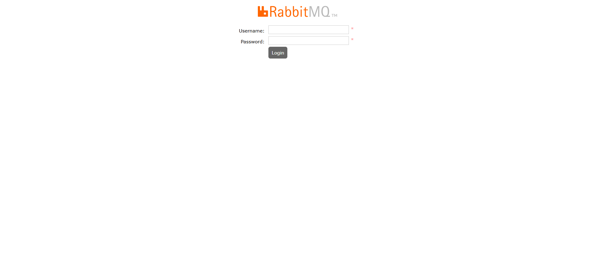
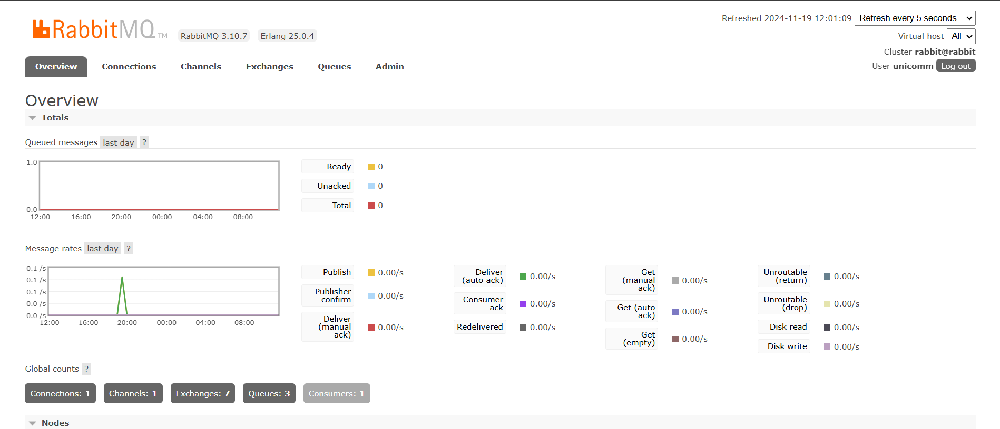

## Инструкция по установке и настройке Unicnet

### Оглавление 
   * [Порядок установки <a name="docker"></a>](#installation-procedure)
   * [Архитектура установки](#-)
     + [Установка на 1-м сервере](#-1-)
   * [Установка docker и docker-compose <a name="docker"></a>](#-docker-docker-compose)
   * [Установка rabbitMQ <a name="rabbitmq"></a>](#-rabbitmq)
      + [Создание compose файла <a name="rabbitmq_compose"></a>](#-compose-)
   * [Установка postgres и postgres-exporter <a name="postgres"></a>](#-postgres-postgres-exporter)
      + [Создание compose файла <a name="postgres_compose"></a>](#-compose--1)
   * [Установка keycloak <a name="keycloak"></a>](#-keycloak)
      + [Создание compose файла <a name="keycloak_compose"></a>](#-compose--2)
   * [Установка mongodb <a name="mongodb"></a>](#-mongodb)
      + [Создание compose файла <a name="mongodb_compose"></a>](#-compose--3)
   * [Установка unicnet <a name="unicnet"></a>](#-unicnet-1)
      + [Создание compose файла <a name="unicnet_compose"></a>](#-compose--4)
   * [Объединение контейнеров в общую docker сеть <a name="docker_network"></a>](#-docker-)
      + [Добавление контейнеров в docker сеть <a name="addtontwork"></a>](#-docker--1)
   * [Настройка unicnet <a name="unicnet_settings"></a> ](#-unicnet-2)
      + [Настройка файла external.config.json <a name="external"></a>](#-externalconfigjson)
      + [Создание пользователя <a name="createuser"></a>](#--1)
      + [Вход в unicnet <a name="unicnetauth"></a>](#-unicnet-3)

<!-- TOC end -->
<!-- TOC --><a name="-"></a>
### Архитектура установки
<!-- TOC --><a name="-1-"></a>
#### Установка на 1-м сервере


<!-- TOC --><a name="installation-procedure"></a>
### Порядок установки <a name="docker"></a>
 * установка docker
 * установка rabbitMQ
 * установка postgres
 * установка postgres-exporter
 * установка keycloak
 * установка mongodb
 * установка unicnet

<!-- TOC --><a name="-docker-docker-compose"></a>
### Установка docker и docker-compose <a name="docker"></a>
Установка производится за рамками инструкции  
Рекомендуется установить docker с официального сайта https://docs.docker.com/engine/install/

<!-- TOC --><a name="-rabbitmq"></a>
### Установка rabbitMQ <a name="rabbitmq"></a>
<!-- TOC --><a name="-compose-"></a>
#### Создание compose файла <a name="rabbitmq_compose"></a>
Создайте 'compose' файл. К примеру rabbit.yml и отредактируйте его следующим образом

``` yml
services:
  rabbitmq.unicomm:
    image: "rabbitmq:3.10.7-management"
    hostname: "rabbit"
    restart: always
    ports:
      - "15672:15672"
      - "5672:5672"
      - "4369:4369"
      - "25672:25672"
    labels:
      NAME: "rabbitmq"
    volumes:
      - ./rabbit/rabbit-unicomm.conf:/etc/rabbitmq/rabbitmq.config
    environment:
      RABBITMQ_DEFAULT_USER: ruser # вставьте свое значение
      RABBITMQ_DEFAULT_PASS: rpassword # вставьте  свое значение 
```
Скачайте образ командой 
``` yml
docker compose -f 'путь до файла' pull
 
```
Создайте контейнер командой
``` yml
docker compose -f 'путь до файла' up -d
 
```
Проверьте логи контейнера
 
``` yml
docker compose -f 'путь до файла' logs

```
Проверьте работоспособноть rabbitMQ





<!-- TOC --><a name="-postgres-postgres-exporter"></a>
### Установка postgres и postgres-exporter <a name="postgres"></a>
<!-- TOC --><a name="-compose--1"></a>
#### Создание compose файла <a name="postgres_compose"></a>
 Создайте 'compose' файл. К примеру postgres.yml и отредактируйте его следующим образом

``` yml 
 version: "3.9"
services:
  postgres:
    container_name: postgres
    image: postgres:alpine3.15
    command:
      - "postgres"
      - "-c"
      - "max_connections=50"
      - "-c"
      - "shared_buffers=1GB"
      - "-c"
      - "effective_cache_size=4GB"
      - "-c"
      - "work_mem=16MB"
      - "-c"
      - "maintenance_work_mem=512MB"
      - "-c"
      - "random_page_cost=1.1"
      - "-c"
      - "temp_file_limit=10GB"
      - "-c"
      - "log_min_duration_statement=200ms"
      - "-c"
      - "idle_in_transaction_session_timeout=10s"
      - "-c"
      - "lock_timeout=1s"
      - "-c"
      - "statement_timeout=60s"
      - "-c"
      - "shared_preload_libraries=pg_stat_statements"
      - "-c"
      - "pg_stat_statements.max=10000"
      - "-c"
      - "pg_stat_statements.track=all"
    environment:
      POSTGRES_DB: "unicnetdb"  # вставьте ваше значение
      POSTGRES_USER: "unicnet" #  вставьте ваше значение
      POSTGRES_PASSWORD: "yourpassword" # вставьте ваше значение
      PGDATA: "/var/lib/postgresql/data/pgdata"
    volumes:
      - .:/var/lib/postgresql/data
    ports:
      - "5432:5432"
    healthcheck:
      test: ["CMD-SHELL", "pg_isready -U unicnet -d unicnetdb"]
      interval: 10s
      timeout: 5s
      retries: 5
      start_period: 10s
    restart: unless-stopped
    deploy:
      resources:
        limits:
          cpus: '1'
          memory: 4G
    networks:
      - unicnetdev_postgres

  postgres_exporter:
    container_name: exporter_container
    image: prometheuscommunity/postgres-exporter:v0.10.0
    environment:
      DATA_SOURCE_URI: "postgres:5432/unicnetdb?sslmode=disable"
      DATA_SOURCE_USER: "unicnet" #вставьте ваше значение
      DATA_SOURCE_PASS: "yourpassword" #вставьте ваше значение
      PG_EXPORTER_EXTEND_QUERY_PATH: "/etc/postgres_exporter/queries.yaml"
    volumes:
      - ./queries.yaml:/etc/postgres_exporter/queries.yaml:ro
    ports:
      - "9187:9187"
    restart: unless-stopped
    deploy:
      resources:
        limits:
          cpus: '0.2'
          memory: 500M
    networks:
      - unicnetdev_postgres

networks:
  unicnetdev_postgres:
    driver: bridge
```

Скачайте образ командой 
``` yml
docker compose -f 'путь до файла' pull
 
```
Создайте контейнер командой
``` yml
docker compose -f 'путь до файла' up -d
 
```
Проверьте логи контейнера
 
``` yml
docker compose -f 'путь до файла' logs

```

<!-- TOC --><a name="-keycloak"></a>
### Установка keycloak <a name="keycloak"></a>
<!-- TOC --><a name="-compose--2"></a>
#### Создание compose файла <a name="keycloak_compose"></a>
Создайте 'compose' файл. К примеру keycloak.yml

``` yml
services:
    keycloak:
        container_name: unicnet_keycloak
        image: bitnami/keycloak:22.0.5
        environment:
          KEYCLOAK_USER: unicomm #вставьте ваше значение
          KEYCLOAK_PASSWORD: #вставьте ваше значение
          KEYCLOAK_ADMIN: unicomm_admin #вставьте ваше значение
          KEYCLOAK_ADMIN_PASSWORD: #вставьте ваше значение
          KEYCLOAK_DATABASE_HOST: postgres
          KEYCLOAK_DATABASE_PORT: 5432
          KEYCLOAK_DATABASE_NAME: unicnetdb #вставьте значение POSTGRES_PASSWORD из файла postges.yml
          KEYCLOAK_DATABASE_USER: unicnet #вставьте значение POSTGRES_PASSWORD из файла postges.yml
          KEYCLOAK_DATABASE_PASSWORD: #вставьте значение POSTGRES_PASSWORD из файла postges.yml
          KEYCLOAK_DATABASE_SCHEMAL: public
          KEYCLOAK_JDBC_PARAMS: sslmode=disable&connectTimeout=30000
#Dev Configuration in order to access in HTTP mode
          KEYCLOAK_HOSTNAME_STRICT: "false"
#deactivate fixed hostname
          KEYCLOAK_HOSTNAME_STRICT_HTTPS: "false"
#For local access to console admin in start mode
          KEYCLOAK_HTTP_ENABLED: "true"
        ports:
            - "8095:8080"
            - "8096:8443"
            - "9990:9990"
        restart: unless-stopped
        networks:
         - unicnetdev_postgres
networks:
  unicnetdev_postgres:
    external: true
```
Скачайте образ командой 
``` yml
docker compose -f 'путь до файла' pull
 
```
Создайте контейнер командой
``` yml
docker compose -f 'путь до файла' up -d
 
```
Проверьте логи контейнера
 
``` yml
docker compose -f 'путь до файла' logs

```

<!-- TOC --><a name="-mongodb"></a>
### Установка mongodb <a name="mongodb"></a>
<!-- TOC --><a name="-compose--3"></a>
#### Создание compose файла <a name="mongodb_compose"></a>
Создайте 'compose' файл. К примеру mongo.yml 
``` yml
version: '3.7'
services:
  mongodb_container:
    container_name: un.mongo.solid
    restart: always
    image: mongo:4.4
    environment:
      MONGO_INITDB_ROOT_USERNAME: unuser # вставьте ваше значение
      MONGO_INITDB_ROOT_PASSWORD: unpassword # вставьте ваше значение
    ports:
      - 27017:27017
    volumes:
      - mongodb_data_container:/data/db

volumes:
  mongodb_data_container:
```

Скачайте образ командой 
``` yml
docker compose -f 'путь до файла' pull
 
```
Создайте контейнер командой
``` yml
docker compose -f 'путь до файла' up -d
 
```
Проверьте логи контейнера
 
``` yml
docker compose -f 'путь до файла' logs

```

 
 
<!-- TOC --><a name="-unicnet-1"></a>
### Установка unicnet <a name="unicnet"></a>
<!-- TOC --><a name="-compose--4"></a>
#### Создание compose файла <a name="unicnet_compose"></a>
  Создайте 'compose' файл. К примеру unicnet.yml и отредактируйте его следующим образом
``` yml
version: "3.7"
services:

  unicnet.solid:
    image: cr.yandex/crpi5ll6mqcn793fvu9i/unicnet.solid:dev
    container_name: unicnet.solid
    ports:
      - "30111:8080"
    volumes:
      - ./app/external.config.json:/app/external.config.json:rw


    restart:
      unless-stopped
  uniwebui:
    image: cr.yandex/crpi5ll6mqcn793fvu9i/unicnet.solid:front
    environment:
      Uc.BackHost: http://10.0.26.93:30111/ #Адрес swagger (def: http://{Uc.BackIp}:30111/)
      Uc.BackHostSW: http://10.0.26.93:30111/swagger/index.html #Адрес swagger web (def: {Uc.BackHost}swagger/index.html)
      Uc.BackHostKC: http://10.0.26.93:8095/ #Адрес KeyCloak (def: http://{Uc.BackIp}:8095/)
      Uc.BackHostRMQ: http:/10.0.26.93:15672/#/queue #Адрес rabbitMQ (def: http://{Uc.BackIp}:15672/#/queue
      Uc.BackIp: "10.0.26.93" #укажите ваш адрес сервера

    ports:
     - "8080:8080"
     - "8081:8081"

    restart: unless-stopped
```
Скачайте образ командой 
``` yml
docker compose -f 'путь до файла' pull
 
```
Создайте контейнер командой
``` yml
docker compose -f 'путь до файла' up -d
 
```
Проверьте логи контейнера
 
``` yml
docker compose -f 'путь до файла' logs

```
 

<!-- TOC --><a name="-docker-"></a>
### Объединение контейнеров в общую docker сеть <a name="docker_network"></a>

Создайте сеть(либо используйте существующю) и включите туда контейнеры описанных в yml файлах:
* keycloak
* postgres
* unicnet 
 #### Создание сети <a name="create_network"></a>
``` yml
docker network create -d bridge unicnetdev_postgres  

``` 
Просмотр существующих сетей 
``` yml 
docker network ls
```
Просмотр запущенных контейнеров
``` yml
docker ps
```
<!-- TOC --><a name="-docker--1"></a>
#### Добавление контейнеров в docker сеть <a name="addtontwork"></a>
``` yml
docker network connect 'имя сети' 'имя контейнера'
``` 
<!-- TOC --><a name="-unicnet-2"></a>
### Настройка unicnet <a name="unicnet_settings"></a> 
<!-- TOC --><a name="-externalconfigjson"></a>
#### Настройка файла external.config.json <a name="external"></a>
Скопируйте файл из запущеного контейнера от образа unicnet.solid.
Команда 
``` yml
docker cp <containerId>:/app/external.config.json ./app/external.config.json
```

Отредактируйте параметры

* "UniVaultToken": Указать  для получение нового токена и сохранения его в файле конфигурации
* "Mongo": {

      "Type": "DbConStringEntry",

      "ConnectionString": "mongodb://user:password@<IP>:27017/?directConnection=true",  //"",значения хранятся в файле mongo.yml, переменных MONGO_INITDB_ROOT_USERNAME и MONGO_INITDB_ROOT_PASSWORD

      "DataBase": "" // ""

    },
* "KeyCloakAuthJwt": {

      "Authority": "http://<IP>:8095/realms/unicnet",

      "AuthorizationUrl": "http://<IP>:8095/realms/unicnet/protocol/openid-connect/auth",

      "TokenUrl": "http://<IP>:8095/realms/unicnet/protocol/openid-connect/token",

      "Audience": "account",

      "Realm": "unicnet",

      "ClientId": "dotnet-solid-client",

      "ClientSecret": "*secret*"

    }

 
 
Перезапустите сервис unicnet

``` yml
docker compose -f 'путь до файла' up -d
 
```
Проверьте логи контейнера
 
``` yml
docker compose -f 'путь до файла' logs
```

<!-- TOC --><a name="--1"></a>
#### Создание пользователя <a name="createuser"></a>
 Для входа в unicnet создайте пользователя в keycloak.
 
 Для этого воспользуйтесь значением из переменных файла keycloak.yml
 * KEYCLOAK_ADMIN: 
 * KEYCLOAK_ADMIN_PASSWORD: 
 
Перейдите по настроенному адресу, используя маппинг порта из файла keycloak.yml (8095) чтобы увидеть страницу авторизации keycloak.
 


 Создайте пользователя
 


 И задайте ему пароль
 

<!-- TOC --><a name="-unicnet-3"></a>
#### Вход в unicnet <a name="unicnetauth"></a>
Возьмите из файла unicnet.yml порт закрепленный для 8080, port:8080. По адресу развёртывания webui на этому порту будет доступна страница авторизации UnicNet.

 
 
