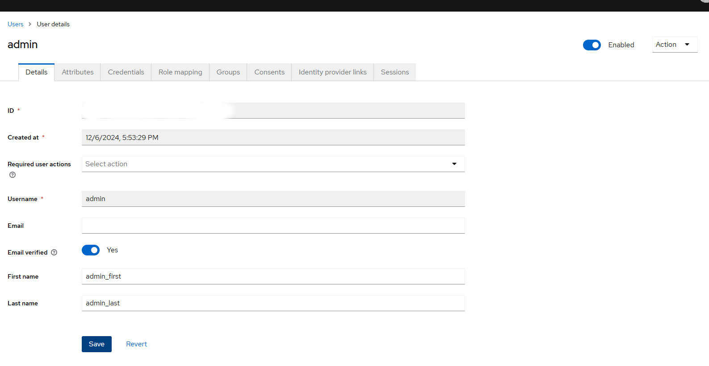

<!-- START doctoc generated TOC please keep comment here to allow auto update -->
<!-- DON'T EDIT THIS SECTION, INSTEAD RE-RUN doctoc TO UPDATE -->
**Table of Contents**

- [Инструкция по установке и настройке Unicnet](#%D0%98%D0%BD%D1%81%D1%82%D1%80%D1%83%D0%BA%D1%86%D0%B8%D1%8F-%D0%BF%D0%BE-%D1%83%D1%81%D1%82%D0%B0%D0%BD%D0%BE%D0%B2%D0%BA%D0%B5-%D0%B8-%D0%BD%D0%B0%D1%81%D1%82%D1%80%D0%BE%D0%B9%D0%BA%D0%B5-unicnet)
  - [Оглавление](#%D0%9E%D0%B3%D0%BB%D0%B0%D0%B2%D0%BB%D0%B5%D0%BD%D0%B8%D0%B5)
  - [Порядок установки](#%D0%9F%D0%BE%D1%80%D1%8F%D0%B4%D0%BE%D0%BA-%D1%83%D1%81%D1%82%D0%B0%D0%BD%D0%BE%D0%B2%D0%BA%D0%B8)
  - [Установка docker и docker-compose](#%D0%A3%D1%81%D1%82%D0%B0%D0%BD%D0%BE%D0%B2%D0%BA%D0%B0-docker-%D0%B8-docker-compose)
  - [Установка rabbitMQ](#%D0%A3%D1%81%D1%82%D0%B0%D0%BD%D0%BE%D0%B2%D0%BA%D0%B0-rabbitmq)
    - [Создание compose файла](#%D0%A1%D0%BE%D0%B7%D0%B4%D0%B0%D0%BD%D0%B8%D0%B5-compose-%D1%84%D0%B0%D0%B9%D0%BB%D0%B0)
  - [Установка postgres и postgres-exporter](#%D0%A3%D1%81%D1%82%D0%B0%D0%BD%D0%BE%D0%B2%D0%BA%D0%B0-postgres-%D0%B8-postgres-exporter)
    - [Создание compose файла](#%D0%A1%D0%BE%D0%B7%D0%B4%D0%B0%D0%BD%D0%B8%D0%B5-compose-%D1%84%D0%B0%D0%B9%D0%BB%D0%B0-1)
  - [Установка keycloak](#%D0%A3%D1%81%D1%82%D0%B0%D0%BD%D0%BE%D0%B2%D0%BA%D0%B0-keycloak)
    - [Создание compose файла](#%D0%A1%D0%BE%D0%B7%D0%B4%D0%B0%D0%BD%D0%B8%D0%B5-compose-%D1%84%D0%B0%D0%B9%D0%BB%D0%B0-2)
  - [Установка mongodb](#%D0%A3%D1%81%D1%82%D0%B0%D0%BD%D0%BE%D0%B2%D0%BA%D0%B0-mongodb)
    - [Создание compose файла](#%D0%A1%D0%BE%D0%B7%D0%B4%D0%B0%D0%BD%D0%B8%D0%B5-compose-%D1%84%D0%B0%D0%B9%D0%BB%D0%B0-3)
  - [Установка unicnet](#%D0%A3%D1%81%D1%82%D0%B0%D0%BD%D0%BE%D0%B2%D0%BA%D0%B0-unicnet)
    - [Создание compose файла](#%D0%A1%D0%BE%D0%B7%D0%B4%D0%B0%D0%BD%D0%B8%D0%B5-compose-%D1%84%D0%B0%D0%B9%D0%BB%D0%B0-4)
  - [Объединение контейнеров в общую docker сеть](#%D0%9E%D0%B1%D1%8A%D0%B5%D0%B4%D0%B8%D0%BD%D0%B5%D0%BD%D0%B8%D0%B5-%D0%BA%D0%BE%D0%BD%D1%82%D0%B5%D0%B9%D0%BD%D0%B5%D1%80%D0%BE%D0%B2-%D0%B2-%D0%BE%D0%B1%D1%89%D1%83%D1%8E-docker-%D1%81%D0%B5%D1%82%D1%8C)
    - [Создание сети](#%D0%A1%D0%BE%D0%B7%D0%B4%D0%B0%D0%BD%D0%B8%D0%B5-%D1%81%D0%B5%D1%82%D0%B8)
    - [Добавление контейнеров в docker сеть](#%D0%94%D0%BE%D0%B1%D0%B0%D0%B2%D0%BB%D0%B5%D0%BD%D0%B8%D0%B5-%D0%BA%D0%BE%D0%BD%D1%82%D0%B5%D0%B9%D0%BD%D0%B5%D1%80%D0%BE%D0%B2-%D0%B2-docker-%D1%81%D0%B5%D1%82%D1%8C)
  - [Настройка unicnet](#%D0%9D%D0%B0%D1%81%D1%82%D1%80%D0%BE%D0%B9%D0%BA%D0%B0-unicnet)
    - [Настройка файла external.config.json](#%D0%9D%D0%B0%D1%81%D1%82%D1%80%D0%BE%D0%B9%D0%BA%D0%B0-%D1%84%D0%B0%D0%B9%D0%BB%D0%B0-externalconfigjson)
    - [Создание пользователя](#%D0%A1%D0%BE%D0%B7%D0%B4%D0%B0%D0%BD%D0%B8%D0%B5-%D0%BF%D0%BE%D0%BB%D1%8C%D0%B7%D0%BE%D0%B2%D0%B0%D1%82%D0%B5%D0%BB%D1%8F)
    - [Вход в unicnet](#%D0%92%D1%85%D0%BE%D0%B4-%D0%B2-unicnet)

<!-- END doctoc generated TOC please keep comment here to allow auto update -->

## Инструкция по установке и настройке Unicnet
### Оглавление 
 <!-- TOC -->
- [Порядок установки](#-)
- [Установка docker и docker-compose](#-docker--docker-compose)
- [Установка rabbitMQ](#-rabbitmq)
  - [Создание compose файла](#-compose-)
- [Установка postgres и postgres-exporter](#-postgres--postgres-exporter)
  - [Создание compose файла](#-compose-)
- [Установка keycloak](#-keycloak)
  - [Создание compose файла](#-compose-)
- [Установка mongodb](#-mongodb)
  - [Создание compose файла](#-compose-)
- [Установка unicnet](#-unicnet)
  - [Создание compose файла](#-compose-)
- [Объединение контейнеров в общую docker сеть](#----docker-)
  - [Создание сети](#-)
  - [Добавление контейнеров в docker сеть](#---docker-)
- [Настройка unicnet](#-unicnet)
  - [Создание пользователя](#-)
  - [Вход в unicnet](#--unicnet)
 <!-- TOC -->
### Порядок установки
 * установка docker
 * установка rabbitMQ
 * установка postgres
 * установка postgres-exporter
 * установка keycloak
 * установка mongodb
 * установка unicnet

### Установка docker и docker-compose  
Установка производится за рамками инструкции  
Рекомендуется установить docker с официального сайта https://docs.docker.com/engine/install/

### Установка rabbitMQ
#### Создание compose файла
Создайте 'compose' файл. К примеру rabbit.yml и отредактируйте его следующим образом

``` yml
services:
  rabbitmq.unicomm:
    image: "rabbitmq:3.10.7-management"
    hostname: "rabbit"
    restart: always
    ports:
      - "15672:15672"
      - "5672:5672"
      - "4369:4369"
      - "25672:25672"
    labels:
      NAME: "rabbitmq"
    volumes:
      - ./rabbit/rabbit-unicomm.conf:/etc/rabbitmq/rabbitmq.config
    environment:
      RABBITMQ_DEFAULT_USER: ruser # вставьте свое значение
      RABBITMQ_DEFAULT_PASS: rpassword # вставьте  свое значение 
```
Скачайте образ командой 
``` yml
docker compose -f 'путь до файла' pull
 
```
Создайте контейнер командой
``` yml
docker compose -f 'путь до файла' up -d
 
```
Проверьте логи контейнера
 
``` yml
docker compose -f 'путь до файла' logs

```
Проверьте работоспособноть rabbitMQ


### Установка postgres и postgres-exporter
#### Создание compose файла
 Создайте 'compose' файл. К примеру postgres.yml и отредактируйте его следующим образом

``` yml 
 version: "3.9"
services:
  postgres:
    container_name: postgres
    image: postgres:alpine3.15
    command:
      - "postgres"
      - "-c"
      - "max_connections=50"
      - "-c"
      - "shared_buffers=1GB"
      - "-c"
      - "effective_cache_size=4GB"
      - "-c"
      - "work_mem=16MB"
      - "-c"
      - "maintenance_work_mem=512MB"
      - "-c"
      - "random_page_cost=1.1"
      - "-c"
      - "temp_file_limit=10GB"
      - "-c"
      - "log_min_duration_statement=200ms"
      - "-c"
      - "idle_in_transaction_session_timeout=10s"
      - "-c"
      - "lock_timeout=1s"
      - "-c"
      - "statement_timeout=60s"
      - "-c"
      - "shared_preload_libraries=pg_stat_statements"
      - "-c"
      - "pg_stat_statements.max=10000"
      - "-c"
      - "pg_stat_statements.track=all"
    environment:
      POSTGRES_DB: "unicnetdb"  # вставьте ваше значение
      POSTGRES_USER: "unicnet" #  вставьте ваше значение
      POSTGRES_PASSWORD: "yourpassword" # вставьте ваше значение
      PGDATA: "/var/lib/postgresql/data/pgdata"
    volumes:
      - .:/var/lib/postgresql/data
    ports:
      - "5432:5432"
    healthcheck:
      test: ["CMD-SHELL", "pg_isready -U unicnet -d unicnetdb"]
      interval: 10s
      timeout: 5s
      retries: 5
      start_period: 10s
    restart: unless-stopped
    deploy:
      resources:
        limits:
          cpus: '1'
          memory: 4G
    networks:
      - unicnetdev_postgres

  postgres_exporter:
    container_name: exporter_container
    image: prometheuscommunity/postgres-exporter:v0.10.0
    environment:
      DATA_SOURCE_URI: "postgres:5432/unicnetdb?sslmode=disable"
      DATA_SOURCE_USER: "unicnet" #вставьте ваше значение
      DATA_SOURCE_PASS: "yourpassword" #вставьте ваше значение
      PG_EXPORTER_EXTEND_QUERY_PATH: "/etc/postgres_exporter/queries.yaml"
    volumes:
      - ./queries.yaml:/etc/postgres_exporter/queries.yaml:ro
    ports:
      - "9187:9187"
    restart: unless-stopped
    deploy:
      resources:
        limits:
          cpus: '0.2'
          memory: 500M
    networks:
      - unicnetdev_postgres

networks:
  unicnetdev_postgres:
    driver: bridge
```

Скачайте образ командой 
``` yml
docker compose -f 'путь до файла' pull
 
```
Создайте контейнер командой
``` yml
docker compose -f 'путь до файла' up -d
 
```
Проверьте логи контейнера
 
``` yml
docker compose -f 'путь до файла' logs

```

### Установка keycloak  
#### Создание compose файла
Создайте 'compose' файл. К примеру keycloak.yml

``` yml
services:
    keycloak:
        container_name: unicnet_keycloak
        image: bitnami/keycloak:22.0.5
        environment:
          KEYCLOAK_USER: unicomm #вставьте ваше значение
          KEYCLOAK_PASSWORD: #вставьте ваше значение
          KEYCLOAK_ADMIN: unicomm_admin #вставьте ваше значение
          KEYCLOAK_ADMIN_PASSWORD: #вставьте ваше значение
          KEYCLOAK_DATABASE_HOST: postgres
          KEYCLOAK_DATABASE_PORT: 5432
          KEYCLOAK_DATABASE_NAME: unicnetdb #вставьте значение POSTGRES_PASSWORD из файла postges.yml
          KEYCLOAK_DATABASE_USER: unicnet #вставьте значение POSTGRES_PASSWORD из файла postges.yml
          KEYCLOAK_DATABASE_PASSWORD: #вставьте значение POSTGRES_PASSWORD из файла postges.yml
          KEYCLOAK_DATABASE_SCHEMAL: public
          KEYCLOAK_JDBC_PARAMS: sslmode=disable&connectTimeout=30000
#Dev Configuration in order to access in HTTP mode
          KEYCLOAK_HOSTNAME_STRICT: "false"
#deactivate fixed hostname
          KEYCLOAK_HOSTNAME_STRICT_HTTPS: "false"
#For local access to console admin in start mode
          KEYCLOAK_HTTP_ENABLED: "true"
        ports:
            - "8095:8080"
            - "8096:8443"
            - "9990:9990"
        restart: unless-stopped
        networks:
         - unicnetdev_postgres
networks:
  unicnetdev_postgres:
    external: true
```
Скачайте образ командой 
``` yml
docker compose -f 'путь до файла' pull
 
```
Создайте контейнер командой
``` yml
docker compose -f 'путь до файла' up -d
 
```
Проверьте логи контейнера
 
``` yml
docker compose -f 'путь до файла' logs

```

### Установка mongodb 
#### Создание compose файла
Создайте 'compose' файл. К примеру mongo.yml 
``` yml
version: '3.7'
services:
  mongodb_container:
    container_name: un.mongo.solid
    restart: always
    image: mongo:4.4
    environment:
      MONGO_INITDB_ROOT_USERNAME: unuser # вставьте ваше значение
      MONGO_INITDB_ROOT_PASSWORD: unpassword # вставьте ваше значение
    ports:
      - 27017:27017
    volumes:
      - mongodb_data_container:/data/db

volumes:
  mongodb_data_container:
```

Скачайте образ командой 
``` yml
docker compose -f 'путь до файла' pull
 
```
Создайте контейнер командой
``` yml
docker compose -f 'путь до файла' up -d
 
```
Проверьте логи контейнера
 
``` yml
docker compose -f 'путь до файла' logs

```

 
 
### Установка unicnet
#### Создание compose файла
  Создайте 'compose' файл. К примеру unicnet.yml и отредактируйте его следующим образом
``` yml
version: "3.7"
services:

  unicnet.solid:
    image: cr.yandex/crpi5ll6mqcn793fvu9i/unicnet.solid:dev
    container_name: unicnet.solid
    ports:
      - "30111:8080"
    volumes:
      - ./app/external.config.json:/app/external.config.json:rw


    restart:
      unless-stopped
  uniwebui:
    image: cr.yandex/crpi5ll6mqcn793fvu9i/unicnet.solid:front
    environment:
      Uc.BackHost: адрес swagger (def: http://{Uc.BackIp}:30111/)
      Uc.BackHostSW:  Адрес swagger web (def: {Uc.BackHost}swagger/index.html)
      Uc.BackHostKC: Адрес KeyCloak (def: http://{Uc.BackIp}:8095/)
      Uc.BackHostRMQ: Адрес rabbitMQ (def: http://{Uc.BackIp}:15672/#/queue
      Uc.BackIp: "10.0.26.93" #укажите ваш  адрес сервера

    ports:
     - "8080:8080"
     - "8081:8081"

    restart: unless-stopped
```
Скачайте образ командой 
``` yml
docker compose -f 'путь до файла' pull
 
```
Создайте контейнер командой
``` yml
docker compose -f 'путь до файла' up -d
 
```
Проверьте логи контейнера
 
``` yml
docker compose -f 'путь до файла' logs

```
 

### Объединение контейнеров в общую docker сеть

Создайте сеть(либо используйте существующю) и включите туда контейнеры описанных в yml файлах:
* keycloak
* postgres
* unicnet 
 #### Создание сети
``` yml
docker network create -d bridge unicnetdev_postgres  

``` 
Просмотр существующих сетей 
``` yml 
docker network ls
```
Просмотр запущенных контейнеров
``` yml
docker ps
```
#### Добавление контейнеров в docker сеть
``` yml
docker network connect 'имя сети' 'имя контейнера'
``` 
### Настройка unicnet 
#### Настройка файла external.config.json
Скопируйте файл из запущеного контейнера от образа unicnet.solid.
Команда 
``` yml
docker cp <containerId>:/app/external.config.json ./app/external.config.json
```

Отредактируйте параметры

* "UniVaultToken": Указать  для получение нового токена и сохранения его в файле конфигурации
* "PushPlatformStaticAddress": Указать адрес http://push1.unic.chat:30111/
* "Mongo": {

      "Type": "DbConStringEntry",

      "ConnectionString": "mongodb://user:password@<IP>:27017/?directConnection=true",  //"",значения хранятся в файле mongo.yml, переменных MONGO_INITDB_ROOT_USERNAME и MONGO_INITDB_ROOT_PASSWORD

      "DataBase": "" // ""

    },
* "KeyCloakAuthJwt": {

      "Authority": "http://<IP>:8095/realms/unicnet",

      "AuthorizationUrl": "http://<IP>:8095/realms/unicnet/protocol/openid-connect/auth",

      "TokenUrl": "http://<IP>:8095/realms/unicnet/protocol/openid-connect/token",

      "Audience": "account",

      "Realm": "unicnet",

      "ClientId": "dotnet-solid-client",

      "ClientSecret": "*secret*"

    }

 
 
Перезапустите сервис unicnet

``` yml
docker compose -f 'путь до файла' up -d
 
```
Проверьте логи контейнера
 
``` yml
docker compose -f 'путь до файла' logs
```

#### Создание пользователя
 Для входа в unicnet создайте пользователя в keycloak.
 
 Для этого воспользуйтесь значением из переменных файла keycloak.yml
 * KEYCLOAK_ADMIN: 
 * KEYCLOAK_ADMIN_PASSWORD: 
 
Перейдите по настроенному адресу, используя маппинг порта из файла keycloak.yml (8095) чтобы увидеть страницу авторизации keycloak.
 
 добавить страница авторизации
 


 Создайте пользователя
 




 И задайте ему пароль
 

#### Вход в unicnet
 Возьмите из файла unicnet.yml порт закрепленный для 8080, port:8080. По этому порту должна быть страница авторизации keycloak.
 

 
 
