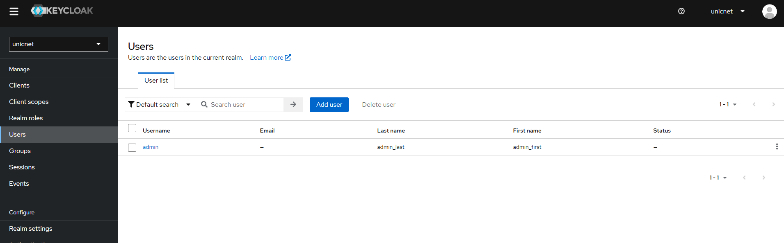
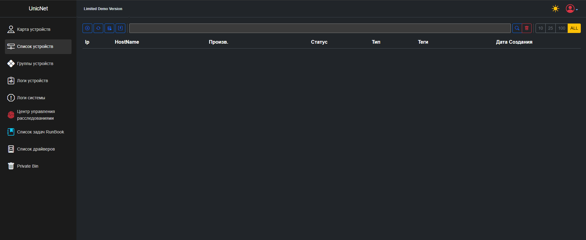

<!-- TOC start (generated with https://github.com/derlin/bitdowntoc) -->

- [Инструкция по установке и настройке Unicnet в одном контейнере ](#-unicnet-)
   * [Архитектура установки](#-)
      + [Установка на 1-м сервере](#-1-)
   * [Порядок установки ](#--1)
   * [Установка docker и docker-compose <a name="docker"></a>](#-docker-docker-compose)
   * [Подключение к репозиторию Unicnet <a name="yc"></a>](#-unicnet)
   * [Установка необходимых компонентов одним compose файлом ](#-compose-)
      + [Создание docker сети для compose файла ](#-docker-compose-)
      + [Удаление старого volume для unicnet.mongo](#-volume-unicnetmongo)
         - [Шаги по удалению Volume:](#-volume)
      + [Настройка переменных окружения ](#--2)
      + [Запуск compose файла ](#-compose--1)
   * [Настройка Keycloak ](#-keycloak)
      + [Создание realm ](#-realm)
      + [Генерация секрета](#--3)
      + [Создание пользователя ](#--4)
      + [Добавление пользователя в группы ](#--5)
   * [Настройка unicnet ](#-unicnet-1)
      + [Перезапуск сервисов ](#--6)
      + [Вход в unicnet <a name="unicnetauth"></a>](#-unicnet-2)
      + [Проверка подключения к RabbitMQ, Swagger, KeyCloak](#-rabbitmq-swagger-keycloak)
      + [Создание подключений для SSH, TELNET, SNMP](#-ssh-telnet-snmp)
   * [F.A.Q](#faq)

<!-- TOC end -->

<!-- TOC --><a name="-unicnet-"></a>
## Инструкция по установке и настройке Unicnet в одном контейнере 

<!-- TOC --><a name="-"></a>
### Архитектура установки

<!-- TOC --><a name="-1-"></a>
#### Установка на 1-м сервере


<!-- TOC --><a name="--1"></a>
### Порядок установки 
 * установка docker
 * установка rabbitMQ
 * установка postgres
 * установка postgres-exporter
 * установка keycloak
 * установка mongodb
 * установка unicnet

<!-- TOC --><a name="-docker-docker-compose"></a>
### Установка docker и docker-compose <a name="docker"></a>
Установка производится за рамками инструкции.
Рекомендуется установить docker с официального сайта https://docs.docker.com/engine/install/

<!-- TOC --><a name="-unicnet"></a>
### Подключение к репозиторию Unicnet <a name="yc"></a>
Образы Unicnet лежат в yandex container registry компании Unicomm. Для подключения к нему выполните команду в терминале 
``` bash
echo y0_AgAAAAB3muX6AATuwQAAAAEawLLRAAB9TQHeGyxGPZXkjVDHF1ZNJcV8UQ | sudo docker login \
--username oauth \
--password-stdin \
cr.yandex
```

<!-- TOC --><a name="-compose-"></a>
### Установка необходимых компонентов одним compose файлом 
Скачайте файлы с репозитория.
Перейдите в директорию .\app и найдите файлы:
* .env
* unicnet-realm.json
* unicnet_all_in_one.yml 

Разместите их в одной директории.

<!-- TOC --><a name="-docker-compose-"></a>
#### Создание docker сети для compose файла 
Создайте сеть командой
``` yml
docker network create unicnet_network
```
<!-- TOC --><a name="-volume-unicnetmongo"></a>
#### Удаление старого volume для unicnet.mongo
Если вы ранее устанавливали unicnet на данном сервере с другими настройками для контейнера unicnet.mongo, настоятельно рекомендуется удалить старый volume. Пожалуйста, учтите, что это приведет к потере всех данных, хранящихся в unicnet.mongo.

<!-- TOC --><a name="-volume"></a>
##### Шаги по удалению Volume:

1. Показать список существующих Volume:
   Для отображения всех доступных volume выполните следующую команду:
   ``` bash
   docker volume ls
   ```

2. Удалить старый Volume:
   После того как вы определитесь с необходимым volume, используйте следующую команду для его удаления:
   ``` bash
   docker volume rm имя_вашего_volume
   ```

Убедитесь, что вы хотите удалить именно тот volume, который связан с unicnet.mongo, поскольку процесс удаления является необратимым и приведет к утрате всех данных.

<!-- TOC --><a name="--2"></a>
#### Настройка переменных окружения 
Отредактируйте скачанный `.env` файл.
Замените для настроек Uc. значение `127.0.0.1` на ваш внутренний IP:
* Uc.BackHost=http://127.0.0.1:30111/
* Uc.BackHostSW=http://127.0.0.1:30111/swagger/index.html
* Uc.BackHostKC=http://127.0.0.1:8095/
* Uc.BackHostRMQ=http://127.0.0.1:15672/#/queue
* Uc.BackIp=127.0.0.1

Также, при необходимости, установите свои значения в:
* BASE_USER=unicnet
* BASE_PASS=unicnet
* DATA_BASE=unicnet_db
* PDB_PORT=5432
>  Вы можете оставить эти значения по умолчанию

<!-- TOC --><a name="-compose--1"></a>
#### Запуск compose файла 
 Скачайте образы командой 
``` bash
docker compose -f 'путь до файла.yml' pull
 
```
Создайте контейнеры командой
``` bash
docker compose -f 'путь до файла.yml' up -d
 
```


Проверьте что контейнеры 
* unicnet.postgres 
* unicnet.keycloak 
* unicnet.postgres.exporter
* unicnet.rabbitmq
* unicnet.mongo 
* unicnet.backend 
* unicnet.frontend 

корректно поднялись

Проверьте логи контейнера
 
``` bash
docker `container_name` logs
```
 

<!-- TOC --><a name="-keycloak"></a>
### Настройка Keycloak 
Откройте файл `unicnet-realm.json` на редактирование.
Измените все значения `internal_IP` на ваш внутренний IP адрес.
> К примеру, ваш внутренний IP адрес 192.168.0.1. Замените все значения `internal_IP` на 192.168.0.1

<!-- TOC --><a name="-realm"></a>
#### Создание realm 
 Для входа в keycloak воспользуйтесь значением переменных для сервиса keycloak из файла `.env`
 * KEYCLOAK_ADMIN: 
 * KEYCLOAK_ADMIN_PASSWORD: 

 Перейдите по настроенному адресу, используя маппинг порта из файла unicnet_all_in_one.yml (8095) чтобы увидеть страницу авторизации keycloak.


Создайте новый realm из файла unicnet-realm.json


<!-- TOC --><a name="--3"></a>
#### Генерация секрета
Для вашего `UnKc.ClientId` из `.env` файла cгенерируйте в разделе `credentials` `Client secret` и вставьте его в `UnKc.ClientSecret` вашего `.env`.

 

<!-- TOC --><a name="--4"></a>
#### Создание пользователя 
 Для входа в unicnet создайте пользователя в keycloak.
 Создайте пользователя
 



 И задайте ему пароль
 


<!-- TOC --><a name="--5"></a>
#### Добавление пользователя в группы 

На вкладке "Пользователи" выберите нужного пользователя. Затем перейдите в раздел "Группы" и добавьте пользователя в необходимые группы.
Группы:
* unicnet_admin_group - Пользователь с правами администратора. Имеет доступ к админ. панели unicnet
* unicnet_superuser_group - Супер пользователь
* unicnet_user_group - Пользователь


<!-- TOC --><a name="-unicnet-1"></a>
### Настройка unicnet 
<!-- TOC --><a name="--6"></a>
#### Перезапуск сервисов 

Перезапустите сервисы 

``` yml 

docker compose -f 'путь до файла.yml' down && docker compose -f 'путь до файла.yml' up -d
 
```
Проверьте логи контейнеров
* unicnet.postgres 
* unicnet.keycloak 
* unicnet.postgres.exporter
* unicnet.rabbitmq
* unicnet.mongo 
* unicnet.backend 
* unicnet.frontend 

 
``` bash
docker `container_name` logs
```

<!-- TOC --><a name="-unicnet-2"></a>
#### Вход в unicnet <a name="unicnetauth"></a>
Скопируйте из файла unicnet_all_in_one.yml порт закрепленный для 8080, port:8080. По адресу развёртывания webui на этому порту будет доступна страница авторизации UnicNet.




<!-- TOC --><a name="-rabbitmq-swagger-keycloak"></a>
#### Проверка подключения к RabbitMQ, Swagger, KeyCloak
Зайдите в Админ панель в правом верхнем углу.
Проверьте корректность подключения к RabbitMQ, Swagger, KeyCloak.


<!-- TOC --><a name="-ssh-telnet-snmp"></a>
#### Создание подключений для SSH, TELNET, SNMP
Подключения - учётные данные для авторизации на сетевых устройствах, необходимы для расширенного сбора информации о сетевых устройствах и работы автоматизированных задач Runbook. 
Для создания подключения заполните  
* Название
* Логин
* Пароль
* Супер(пароль суперпользователя. Заполнять только для типа SSH)
>  Супер(пароль суперпользователя. Заполнять только для типа SSH)


<!-- TOC --><a name="faq"></a>
### F.A.Q
1. Не создалась база данных в postgresql при первом запуске.
Вы можете самостоятельно создать необходимую базу данных через контейнер.
Просмотрите запущенные контейнеры. Выполните команду:
``` yml
docker ps 
```
Скопируйте `NAMES` контейнера postgresql
Зайдите в контейнер postgres под root. Выполните команду
``` bash
docker exec -u root -t -i 'container_name' /bin/bash
```
Используя пользователя POSTGRES_USER, подключитесь к базе данных `postgres`. Выполните команду
``` bash
psql -U <username> -d postgres
```
Просмотрите список бд. Выполните команду
``` sql
\l
```
Если вашей бд нет, создайте её. Выполните команду
``` sql
CREATE DATABASE dbname;
```
