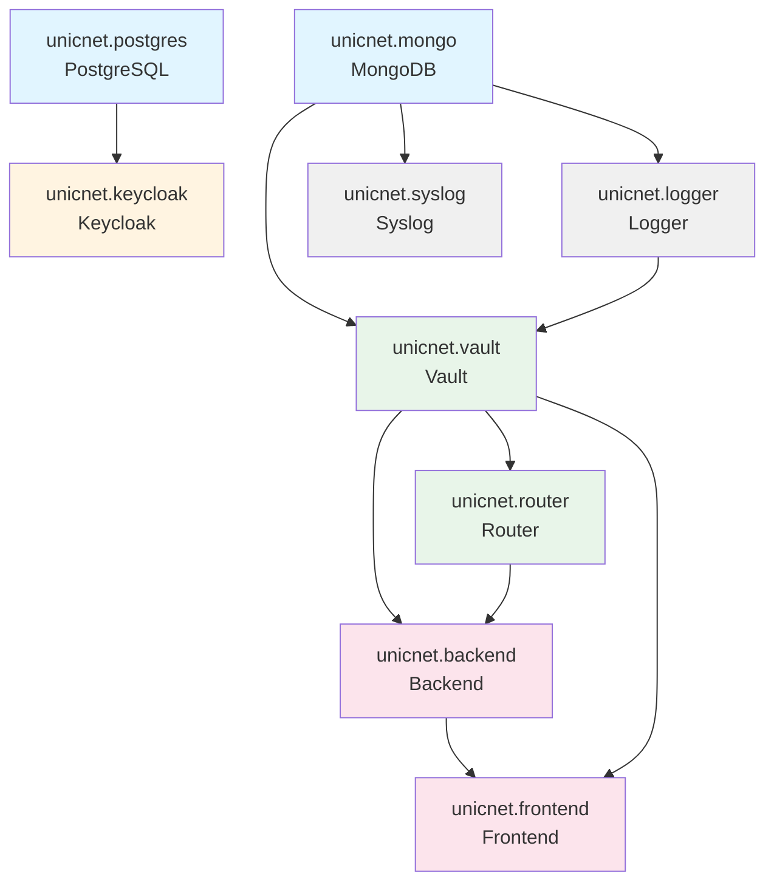

# Диаграмма зависимостей сервисов UnicNet Enterprise

## Граф зависимостей (Mermaid)



## Текстовая диаграмма зависимостей

```
┌─────────────────────┐
│  unicnet.postgres   │  (Базовый сервис - БД для Keycloak)
└──────────┬──────────┘
           │
           ▼
┌─────────────────────┐
│  unicnet.keycloak   │  (IAM - Identity & Access Management)
└─────────────────────┘

┌─────────────────────┐
│   unicnet.mongo     │  (Базовый сервис - NoSQL БД)
└──────────┬──────────┘
           │
           ├──────────────────┬──────────────────┐
           ▼                  ▼                  ▼
┌─────────────────┐  ┌─────────────────┐  ┌─────────────────┐
│ unicnet.logger   │  │ unicnet.syslog   │  │ unicnet.vault   │
│   (Logger)       │  │   (Syslog)       │  │   (Vault)       │
└────────┬────────┘  └──────────────────┘  └────────┬────────┘
         │                                           │
         └───────────────┬───────────────────────────┘
                         │
                         ▼
              ┌─────────────────────┐
              │ unicnet.router      │  (Router)
              └──────────┬──────────┘
                         │
                         ▼
              ┌─────────────────────┐
              │ unicnet.backend     │  (Backend API)
              └──────────┬──────────┘
                         │
                         ▼
              ┌─────────────────────┐
              │ unicnet.frontend    │  (Frontend UI)
              └─────────────────────┘
```

## Детальное описание зависимостей

### Уровень 0 (Базовые сервисы - нет зависимостей)
- **unicnet.postgres** - PostgreSQL база данных
- **unicnet.mongo** - MongoDB база данных

### Уровень 1 (Зависят от базовых БД)
- **unicnet.keycloak** → зависит от `unicnet.postgres`
- **unicnet.logger** → зависит от `unicnet.mongo`
- **unicnet.syslog** → зависит от `unicnet.mongo`

### Уровень 2 (Зависят от сервисов уровня 1)
- **unicnet.vault** → зависит от `unicnet.mongo` и `unicnet.logger`

### Уровень 3 (Зависят от Vault)
- **unicnet.router** → зависит от `unicnet.vault`

### Уровень 4 (Зависят от Router и Vault)
- **unicnet.backend** → зависит от `unicnet.vault` и `unicnet.router`

### Уровень 5 (Зависят от Backend)
- **unicnet.frontend** → зависит от `unicnet.backend` и `unicnet.vault`

## Порядок запуска сервисов

1. **unicnet.postgres** (PostgreSQL)
2. **unicnet.mongo** (MongoDB)
3. **unicnet.keycloak** (после postgres)
4. **unicnet.logger** (после mongo)
5. **unicnet.syslog** (после mongo)
6. **unicnet.vault** (после mongo и logger)
7. **unicnet.router** (после vault)
8. **unicnet.backend** (после vault и router)
9. **unicnet.frontend** (после backend и vault)

## Примечания

- Все сервисы используют общую сеть `unicnet_network`
- Все сервисы требуют переменную окружения `UniCommLicenseData`
- MongoDB используется тремя сервисами: logger, syslog, vault
- Vault является центральным сервисом для backend, frontend и router

