# Оглавление

- [Инструкция по установке и настройке Unicnet](#-unicnet)
  - [🚨 КРИТИЧЕСКИ ВАЖНО: ЛИЦЕНЗИЯ ОБЯЗАТЕЛЬНА ПЕРЕД УСТАНОВКОЙ](#-критически-важно-лицензия-обязательна-перед-установкой)
- [Архитектура установки](#-)
  - [Установка на 1-м сервере](#-1-)
  - [Зависимости сервисов](#-deps)
- [Автоматизированная установка с помощью скрипта](#--1)
  - [Шаги по использованию скрипта](#--2)
- [Ручная установка](#--3)
  - [Порядок установки](#--4)
  - [1. Клонирование репозитория](#-clone-repo)
  - [2. Установка зависимостей (Docker, Docker Compose)](#-docker-docker-compose)
  - [3. Создание Docker сети](#-docker-compose-)
  - [4. Docker login в Yandex CR](#-unicnet-1)
  - [5. Запуск Docker Compose](#-compose-)
    - [Настройка переменных окружения](#настройка-переменных-окружения)
    - [Запуск контейнеров](#запуск-контейнеров)
  - [6. Создание пользователей и БД в MongoDB](#--5)
    - [1. Создание пользователя для UnicNet](#1-создание-пользователя-для-unicnet)
    - [2. Создание пользователя для Logger](#2-создание-пользователя-для-logger)
    - [3. Создание пользователя для Vault](#3-создание-пользователя-для-vault)
  - [7. Получение токена Vault](#-vault-token)
  - [8. Создание секрета в Vault](#-vault-secret)
  - [9. Ожидание готовности Keycloak](#-keycloak-wait)
  - [10. Импорт realm](#-keycloak-realm)
  - [11. Создание пользователя и назначение 3 групп](#-keycloak-user)
    - [Создание пользователя](#создание-пользователя)
    - [Установка пароля](#установка-пароля)
    - [Добавление пользователя в группы](#добавление-пользователя-в-группы)
  - [12. Перезапуск Docker Compose](#-restart-compose)
  - [Проверка работы системы](#-unicnet-2)
    - [Вход в UnicNet](#вход-в-unicnet)
    - [Проверка подключения к Swagger, KeyCloak](#проверка-подключения-к-swagger-keycloak)
    - [Создание подключений для SSH, TELNET, SNMP](#создание-подключений-для-ssh-telnet-snmp)
- [F.A.Q](#faq)


<!-- TOC --><a name="-unicnet"></a>
## Инструкция по установке и настройке Unicnet 

<div style="background-color: #ff0000; border: 4px solid #cc0000; padding: 20px; margin: 30px 0; border-radius: 8px; color: #ffffff; font-weight: bold;">

### 🚨 КРИТИЧЕСКИ ВАЖНО: ЛИЦЕНЗИЯ ОБЯЗАТЕЛЬНА ПЕРЕД УСТАНОВКОЙ

**⚠️ ВНИМАНИЕ! Перед началом установки UnicNet Enterprise ОБЯЗАТЕЛЬНО необходимо:**

1. **📋 Запросить лицензию** у поставщика или администратора системы
2. **⚙️ Установить лицензию** в переменную окружения `UniCommLicenseData` перед запуском Docker Compose
3. **✅ Проверить**, что лицензия корректно передана во все сервисы

**❌ БЕЗ ДЕЙСТВУЮЩЕЙ ЛИЦЕНЗИИ СИСТЕМА НЕ БУДЕТ РАБОТАТЬ КОРРЕКТНО!**

**Как установить лицензию:**

```bash
# Экспортируйте переменную окружения с лицензией
export UniCommLicenseData="ваша_лицензия_здесь"

# Или добавьте в файл export_variables.txt:
# export UniCommLicenseData="ваша_лицензия_здесь"
```

> **⚠️ ВАЖНО**: Лицензия используется всеми сервисами (Backend, Frontend, Logger, Syslog, Vault, Router). Убедитесь, что переменная `UniCommLicenseData` экспортирована перед запуском `docker-compose up`.

</div>

<!-- TOC --><a name="-"></a>
## Архитектура установки

<!-- TOC --><a name="-1-"></a>
### Установка на 1-м сервере

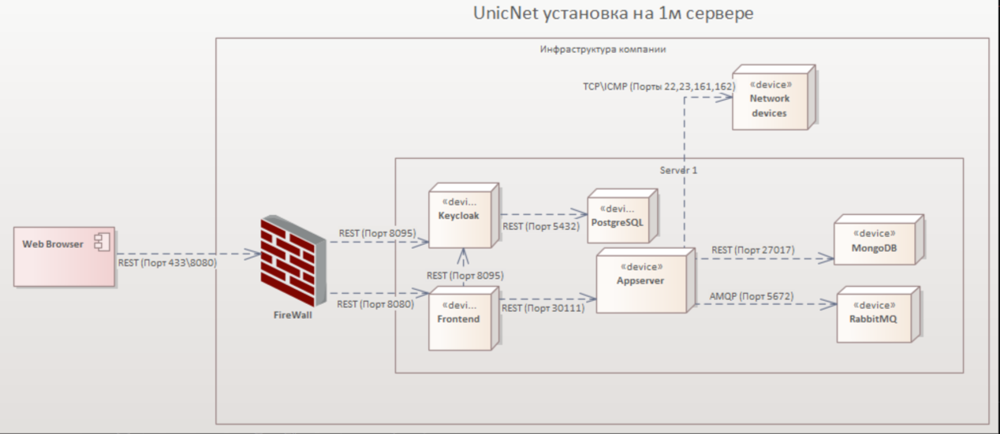

<!-- TOC --><a name="-deps"></a>
### Зависимости сервисов

Ниже представлена диаграмма зависимостей между сервисами UnicNet Enterprise. Стрелки показывают, какие сервисы зависят от других.


> **Примечание**: Диаграмма автоматически генерируется из `docker-compose.yml` с помощью скрипта `diagrams/generate_diagram.sh`. Для обновления диаграммы выполните: `cd diagrams && ./generate_diagram.sh`

**Уровни зависимостей:**

- **Уровень 0 (Базовые сервисы):** `unicnetpostgres`, `unicnetmongo`
- **Уровень 1:** `unicnetkeycloak` → postgres
- **Уровень 2:** `unicnetvault` → mongo; `unicnetrouter` → (нет зависимостей)
- **Уровень 3:** `unicnetsyslog` → mongo, vault
- **Уровень 4:** `unicnetbackend` → vault, router, syslog
- **Уровень 5:** `unicnetfrontend` → backend, keycloak
- **Уровень 6:** `unicnetlogger` → mongo, vault, syslog, backend, frontend

**Порядок запуска сервисов:**

1. `unicnetpostgres` (PostgreSQL)
2. `unicnetmongo` (MongoDB)
3. `unicnetkeycloak` (после postgres)
4. `unicnetvault` (после mongo)
5. `unicnetsyslog` (после mongo и vault)
6. `unicnetrouter` (независимый сервис)
7. `unicnetbackend` (после vault, router и syslog)
8. `unicnetfrontend` (после backend и keycloak)
9. `unicnetlogger` (после mongo, vault, syslog, backend и frontend)

> **Примечание**: Docker Compose автоматически учитывает зависимости через `depends_on` и запускает сервисы в правильном порядке.

<!-- TOC --><a name="--1"></a>
## Автоматизированная установка с помощью скрипта

Для упрощения процесса установки и настройки UnicNet Enterprise (версия 11.1) вы можете использовать интерактивный скрипт `install.sh`. 
Этот скрипт автоматизирует большинство шагов, описанных в разделе ручной установки, включая проверку зависимостей, клонирование репозитория, настройку переменных окружения, запуск Docker Compose, импорт realm в Keycloak, создание пользователя и назначение групп. Скрипт поддерживает uninstall/reinstall и генерирует безопасные пароли.

**⚠️ Требования перед запуском скрипта:**

- **Docker** должен быть установлен и запущен
- **Docker Compose** (v2: `docker compose` или v1: `docker-compose`) должен быть установлен

Скрипт автоматически проверит наличие этих инструментов при запуске. Если они отсутствуют, установите их вручную:
- Docker: https://docs.docker.com/engine/install/
- Docker Compose: обычно устанавливается вместе с Docker, или отдельно: https://docs.docker.com/compose/install/

<!-- TOC --><a name="--2"></a>
### Шаги по использованию скрипта:

1. **Клонируйте репозиторий**: Выполните клонирование репозитория `unicnet.enterprise`:

   ```bash
   git clone https://github.com/rightsoftware-ru/unicnet.enterprise.git
   cd unicnet.enterprise
   ```

2. **Сделайте скрипт исполняемым**:

   ```bash
   chmod +x install.sh
   ```

3. **Настройка переменных окружения**:

   > **🚨 КРИТИЧЕСКИ ВАЖНО**: Перед запуском скрипта установки **ОБЯЗАТЕЛЬНО** необходимо установить лицензию в переменную окружения `UniCommLicenseData`. Без действующей лицензии система не будет работать корректно!

   Перед запуском скрипта установки необходимо отредактировать и применить переменные окружения из файла `export_variables.txt`:

   1. **Отредактируйте файл `export_variables.txt`** в корне репозитория:

      ```bash
      nano export_variables.txt
      ```

      > **Примечание**: Вы можете использовать любой другой текстовый редактор вместо `nano` (например, `vi`, `vim`, `gedit`, `code` и т.д.).

      > **⚠️ ВАЖНО**: Обязательно измените значения переменных под вашу конфигурацию, особенно **пароли**:
      > - `POSTGRES_PASSWORD` - пароль для PostgreSQL
      > - `MONGO_INITDB_ROOT_PASSWORD` - пароль root пользователя MongoDB
      > - `MONGO_UNICNET_PASSWORD` - пароль для пользователя UnicNet в MongoDB
      > - `MONGO_LOGGER_PASSWORD` - пароль для пользователя Logger в MongoDB
      > - `MONGO_VAULT_PASSWORD` - пароль для пользователя Vault в MongoDB
      > - `KEYCLOAK_ADMIN_PASSWORD` - пароль администратора Keycloak
      > - `UniCommLicenseData` - **ОБЯЗАТЕЛЬНО** замените `default_license_data` на вашу реальную лицензию
      > - `RouterCidr` - **ОБЯЗАТЕЛЬНО** замените  на ваш реальный CIDR

   2. **Примените переменные окружения** из отредактированного файла:

      ```bash
      source export_variables.txt
      ```

      Или:

      ```bash
      . export_variables.txt
      ```

   3. **Проверьте, что переменные окружения применены**, особенно лицензия:

      ```bash
      echo $UniCommLicenseData
      ```

      > **⚠️ ВАЖНО**: Лицензия используется всеми сервисами (Backend, Frontend, Logger, Syslog, Vault, Router). Убедитесь, что переменная `UniCommLicenseData` содержит вашу реальную лицензию, а не `default_license_data`, и экспортирована перед запуском скрипта установки.

4. **Запустите скрипт**:

   ```bash
   ./install.sh
   ```
   - Скрипт соберёт необходимые входные данные (IP сервера, пароли и т.д.) интерактивно или загрузит из конфигурационного файла, если он существует.
   - Выберите опцию "0" для полной автоматической установки или отдельные шаги для ручного управления.
5. **После выполнения**: Проверьте итоговый вывод скрипта с URL и учётными данными. Если нужно, продолжите с ручными шагами из раздела "Ручная установка" (например, проверка подключений в UnicNet).

**Примечания**:
- Если скрипт завершится ошибкой, проверьте логи контейнеров и вернитесь к ручным шагам ниже.
- При повторном запуске скрипт использует конфигурационные данные из файла unicnet_installer.conf, созданного при первом запуске.
- **Важно**: Если какой-либо шаг завершился с ошибкой (особенно HTTP 401 или проблемы с токенами), попробуйте запустить его повторно. Иногда сервисы (Keycloak, Vault) могут быть не полностью готовы при первом запросе, и повторный запуск обычно решает проблему.

<!-- TOC --><a name="--3"></a>
## Ручная установка

<!-- TOC --><a name="--4"></a>
### Порядок установки

Порядок установки соответствует шагам из интерактивного скрипта `install.sh`:

1. **Клонировать этот репозиторий**
2. **Установить зависимости** (Docker, Docker Compose)
3. **Создать сеть Docker**
4. **Docker login в Yandex CR** 
5. **Запустить Docker Compose**
6. **Создать пользователей и БД в MongoDB**
7. **Получить токен Vault**
8. **Создать секрет в Vault**
9. **Дождаться готовности Keycloak**
10. **Импортировать realm**
11. **Создать пользователя и назначение 3 групп**
12. **Перезапустить Docker Compose** (down и up -d)

<!-- TOC --><a name="-clone-repo"></a>
### 1. Клонирование репозитория

Клонируйте репозиторий `unicnet.enterprise`:

```bash
git clone https://github.com/rightsoftware-ru/unicnet.enterprise.git
cd unicnet.enterprise
```

<!-- TOC --><a name="-docker-docker-compose"></a>
### 2. Установка зависимостей (Docker, Docker Compose)

Установка производится за рамками инструкции. Рекомендуется установить Docker с официального сайта https://docs.docker.com/engine/install/

Docker Compose обычно устанавливается вместе с Docker, или отдельно: https://docs.docker.com/compose/install/

<!-- TOC --><a name="-docker-compose-"></a>
### 3. Создание Docker сети

Создайте сеть командой:

```bash
docker network create unicnet_network
```

<!-- TOC --><a name="-unicnet-1"></a>
### 4. Docker login в Yandex CR

Образы UnicNet Enterprise находятся в Yandex Container Registry компании «ПРАВИЛЬНЫЙ СОФТ». 

Для подключения к реестру выполните команду в терминале:

```bash
echo y0_AgAAAAB3muX6AATuwQAAAAEawLLRAAB9TQHeGyxGPZXkjVDHF1ZNJcV8UQ | docker login \
--username oauth \
--password-stdin \
cr.yandex
```

> **Примечание**: Токен может быть изменен. Если команда не работает, запросите актуальный токен у администратора.

**Актуальные образы:**
- PostgreSQL: `cr.yandex/crp39psc34hg49unp6p7/postgres:alpine3.15`
- MongoDB: `cr.yandex/crp39psc34hg49unp6p7/mongo:4.4`
- Keycloak: `cr.yandex/crp39psc34hg49unp6p7/keycloak:22.0.5`
- Backend: `cr.yandex/crpi5ll6mqcn793fvu9i/unic/unicnetbackend:prod`
- Frontend: `cr.yandex/crpi5ll6mqcn793fvu9i/unicnet.solid/prod:front251222`
- Logger: `cr.yandex/crpi5ll6mqcn793fvu9i/unic/uniclogger:prod`
- Vault: `cr.yandex/crpi5ll6mqcn793fvu9i/unic/unicvault:prod`
- Syslog: `cr.yandex/crpi5ll6mqcn793fvu9i/unic/unicnetsyslog:prod`
- Router: `cr.yandex/crpi5ll6mqcn793fvu9i/unic/unicnetrouter:prod`

<!-- TOC --><a name="-compose-"></a>
### 5. Запуск Docker Compose

> **🚨 КРИТИЧЕСКИ ВАЖНО**: Перед запуском Docker Compose **ОБЯЗАТЕЛЬНО** необходимо установить лицензию в переменную окружения `UniCommLicenseData`. Без действующей лицензии система не будет работать корректно!

#### Настройка переменных окружения

Перед запуском Docker Compose необходимо отредактировать и применить переменные окружения из файла `export_variables.txt`:

1. **Отредактируйте файл `export_variables.txt`** в корне репозитория:

   ```bash
   nano export_variables.txt
   ```

   > **Примечание**: Вы можете использовать любой другой текстовый редактор вместо `nano` (например, `vi`, `vim`, `gedit`, `code` и т.д.).

   > **⚠️ ВАЖНО**: Обязательно измените значения переменных под вашу конфигурацию, особенно **пароли**:
   > - `POSTGRES_PASSWORD` - пароль для PostgreSQL
   > - `MONGO_INITDB_ROOT_PASSWORD` - пароль root пользователя MongoDB
   > - `MONGO_UNICNET_PASSWORD` - пароль для пользователя UnicNet в MongoDB
   > - `MONGO_LOGGER_PASSWORD` - пароль для пользователя Logger в MongoDB
   > - `MONGO_VAULT_PASSWORD` - пароль для пользователя Vault в MongoDB
   > - `KEYCLOAK_ADMIN_PASSWORD` - пароль администратора Keycloak
   > - `UniCommLicenseData` - **ОБЯЗАТЕЛЬНО** замените `default_license_data` на вашу реальную лицензию
   > - `RouterCidr` - **ОБЯЗАТЕЛЬНО** замените  на ваш реальный CIDR

2. **Примените переменные окружения** из отредактированного файла:

   ```bash
   source export_variables.txt
   ```

   Или:

   ```bash
   . export_variables.txt
   ```

3. **Проверьте, что переменные окружения применены**, особенно лицензия:

   ```bash
   echo $UniCommLicenseData
   ```

   > **⚠️ ВАЖНО**: Лицензия используется всеми сервисами (Backend, Frontend, Logger, Syslog, Vault, Router). Убедитесь, что переменная `UniCommLicenseData` содержит вашу реальную лицензию, а не `default_license_data`, и экспортирована перед запуском `docker-compose up`.

#### Запуск контейнеров

Перейдите в директорию `./app` и найдите файлы:

- `docker-compose.yml` - Docker Compose файл со всеми сервисами
- `keycloak-import/unicnet-realm.json` - конфигурация realm для Keycloak (уже настроена на использование внутренних адресов контейнеров)

> **Примечание**: В зависимости от версии Docker Compose используйте:
> - `docker compose` (Docker Compose V2, встроен в Docker)
> - `docker-compose` (Docker Compose V1, отдельная утилита)

Скачайте образы командой:

**Для Docker Compose V2:**
```bash
cd app
docker compose -f docker-compose.yml pull
```

**Для Docker Compose V1:**
```bash
cd app
docker-compose -f docker-compose.yml pull
```

Создайте контейнеры командой:

**Для Docker Compose V2:**
```bash
docker compose -f docker-compose.yml up -d
```

**Для Docker Compose V1:**
```bash
docker-compose -f docker-compose.yml up -d
```

<!-- TOC --><a name="--5"></a>
### 6. Создание пользователей и БД в MongoDB

После запуска контейнеров необходимо создать **трех пользователей** и соответствующие базы данных в MongoDB. Это выполняется автоматически скриптом `install.sh`, но при ручной установке можно выполнить через MongoDB команды.

> **Примечание**: Используйте переменные окружения из файла `export_variables.txt`, которые вы применили на шаге 5. Убедитесь, что переменные экспортированы перед выполнением команд.

Создайте пользователей и базы данных, используя переменные окружения. Выполните следующие команды:

#### 1. Создание пользователя для UnicNet

```bash
docker exec -it unicnetmongo mongo admin -u ${MONGO_INITDB_ROOT_USERNAME} -p ${MONGO_INITDB_ROOT_PASSWORD} --eval "
db = db.getSiblingDB('${MONGO_UNICNET_DB}');
db.createUser({
  user: '${MONGO_UNICNET_USER}',
  pwd: '${MONGO_UNICNET_PASSWORD}',
  roles: [{ role: 'readWrite', db: '${MONGO_UNICNET_DB}' }]
});
"
```

#### 2. Создание пользователя для Logger

```bash
docker exec -it unicnetmongo mongo admin -u ${MONGO_INITDB_ROOT_USERNAME} -p ${MONGO_INITDB_ROOT_PASSWORD} --eval "
db = db.getSiblingDB('${MONGO_LOGGER_DB}');
db.createUser({
  user: '${MONGO_LOGGER_USER}',
  pwd: '${MONGO_LOGGER_PASSWORD}',
  roles: [{ role: 'readWrite', db: '${MONGO_LOGGER_DB}' }]
});
"
```

#### 3. Создание пользователя для Vault

```bash
docker exec -it unicnetmongo mongo admin -u ${MONGO_INITDB_ROOT_USERNAME} -p ${MONGO_INITDB_ROOT_PASSWORD} --eval "
db = db.getSiblingDB('${MONGO_VAULT_DB}');
db.createUser({
  user: '${MONGO_VAULT_USER}',
  pwd: '${MONGO_VAULT_PASSWORD}',
  roles: [{ role: 'readWrite', db: '${MONGO_VAULT_DB}' }]
});
"
```

> **Примечание**: Если пользователи уже существуют, MongoDB вернет ошибку. Это нормально - пользователи уже созданы. При необходимости можно использовать `db.updateUser()` для изменения паролей.

<!-- TOC --><a name="-vault-token"></a>
### 7. Получение токена Vault

Для работы с Vault API необходимо получить токен. Выполните запрос к API Vault:

```bash
curl -s "http://localhost:8200/api/token/0f8e160416b94225a73f86ac23b9118b?username=UNFrontV2"
```

Сохраните полученный токен для использования в следующем шаге.

<!-- TOC --><a name="-vault-secret"></a>
### 8. Создание секрета в Vault

Создайте секрет в Vault с метаданными для работы системы. Используйте токен, полученный на предыдущем шаге:

Перед выполнением команды скопируйте значения из переменных окружения:

```bash
echo "KeyCloak.AdmUn: ${KEYCLOAK_ADMIN_USER}"
echo "KeyCloak.AdmPw: ${KEYCLOAK_ADMIN_PASSWORD}"
```

> **Примечание**: Значения для Keycloak берутся из переменных окружения, которые вы применили на шаге 5:
> - `KeyCloak.AdmUn` - скопируйте значение из переменной `${KEYCLOAK_ADMIN_USER}` (по умолчанию: `unicnet`)
> - `KeyCloak.AdmPw` - скопируйте значение из переменной `${KEYCLOAK_ADMIN_PASSWORD}` (по умолчанию: `admin123`)
> - `KeyCloak.Realm` - имя realm из файла `app/keycloak-import/unicnet-realm.json` (обычно: `unicnet`)

Создайте секрет в Vault, заменив значения в команде:

```bash
curl -X POST "http://localhost:8200/api/Secrets" \
  -H "Authorization: Bearer ваш_токен" \
  -H "Content-Type: application/json" \
  -d '{
    "id": "UNFrontV2",
    "name": "UNFrontV2",
    "type": "Password",
    "data": "Empty",
    "metadata": {
      "api.keycloak.url": "http://unicnetkeycloak:8080/",
      "api.license.url": "http://unicnet.license",
      "api.backend.url": "http://unicnetbackend:8080/",
      "api.logger.url": "http://unicnetlogger:8080/",
      "api.syslog.url": "http://unicnetsyslog:8080/",
      "KeyCloak.AdmUn": "скопируйте_значение_из_KEYCLOAK_ADMIN_USER",
      "KeyCloak.AdmPw": "скопируйте_значение_из_KEYCLOAK_ADMIN_PASSWORD",
      "KeyCloak.Realm": "unicnet",
      "RouterHotSpot": "unicnetrouter:30115"
    },
    "tags": [],
    "expiresAt": "2050-12-31T23:59:59.999Z"
  }'
```

> **Важно**: 
> - Замените `ваш_токен` на токен, полученный на шаге 7
> - Замените `скопируйте_значение_из_KEYCLOAK_ADMIN_USER` на значение из переменной `${KEYCLOAK_ADMIN_USER}`
> - Замените `скопируйте_значение_из_KEYCLOAK_ADMIN_PASSWORD` на значение из переменной `${KEYCLOAK_ADMIN_PASSWORD}`
> - Значение `KeyCloak.Realm` должно соответствовать имени realm из файла `app/keycloak-import/unicnet-realm.json` (обычно `unicnet`)

<!-- TOC --><a name="-keycloak-wait"></a>
### 9. Ожидание готовности Keycloak

Дождитесь полной готовности Keycloak перед продолжением. Проверьте готовность:

```bash
curl http://localhost:8095/health/ready
```

Или проверьте через веб-интерфейс: `http://<SERVER_IP>:8095`

<!-- TOC --><a name="-keycloak-realm"></a>
### 10. Импорт realm

Импорт realm выполняется через графический интерфейс Keycloak:

1. Перейдите по адресу `http://<SERVER_IP>:8095`
2. Войдите в консоль администратора Keycloak с учетными данными:
   - Username: `unicnet` (или значение из `KEYCLOAK_ADMIN_USER`)
   - Password: `admin123` (или значение из `KEYCLOAK_ADMIN_PASSWORD`)

   Или прочитайте credentials из контейнера:
   ```bash
   docker inspect unicnetkeycloak | grep -E "KEYCLOAK_ADMIN_USER|KEYCLOAK_ADMIN_PASSWORD"
   ```

3. В веб-интерфейсе Keycloak:
   - **Наведите курсор на выпадающий список "Master"** (в левом верхнем углу сайдбара, рядом с логотипом Keycloak)
   - В появившемся меню нажмите **"Create Realm"**
 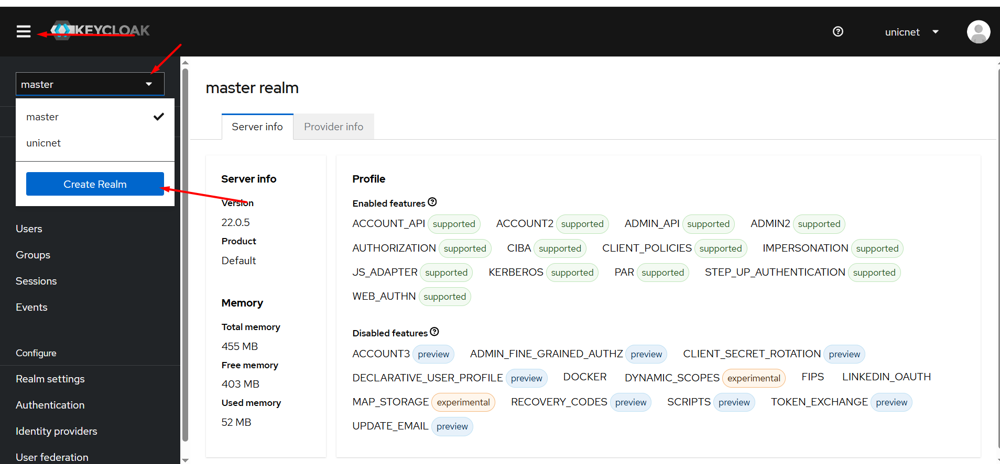
   - Нажмите **"Select file"** и выберите файл `app/keycloak-import/unicnet-realm.json`
   - Нажмите **"Create"**

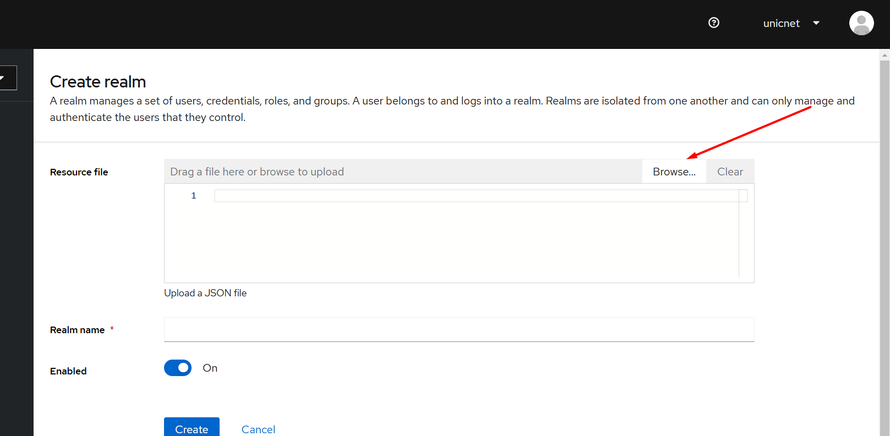

> **Примечание**: Файл `unicnet-realm.json` уже настроен на использование внутренних адресов контейнеров Docker. Дополнительные изменения не требуются.

<!-- TOC --><a name="-keycloak-user"></a>
### 11. Создание пользователя и назначение 3 групп

Создание пользователя и назначение групп выполняется через графический интерфейс Keycloak:

#### Создание пользователя

1. В веб-интерфейсе Keycloak перейдите в созданный realm (по умолчанию `unicnet`)
2. В левом меню выберите "Users"
3. Нажмите "Add user"
4. Заполните форму:
   - **Username**: например, `unicadmin`
   - **Email**: например, `unicadmin@local.com`
   - Включите опции "Email verified" и "Enabled"
5. Нажмите "Create"

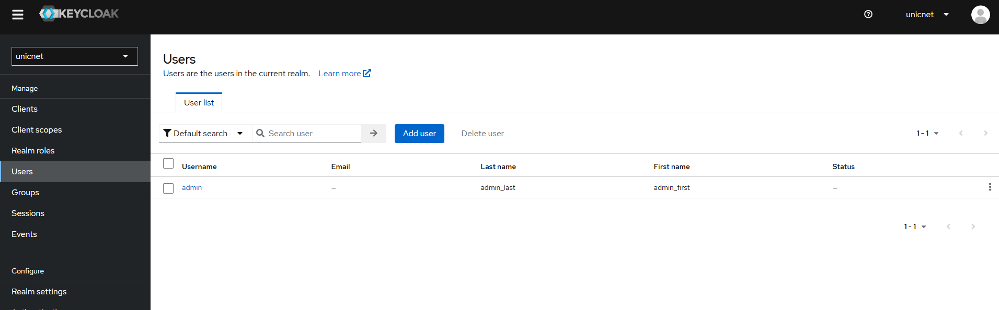

#### Установка пароля

1. Перейдите на вкладку "Credentials" созданного пользователя
2. Нажмите "Set password"
3. Введите пароль и подтвердите его
4. Отключите опцию "Temporary" (чтобы пользователь не был вынужден менять пароль при первом входе)
5. Нажмите "Save"

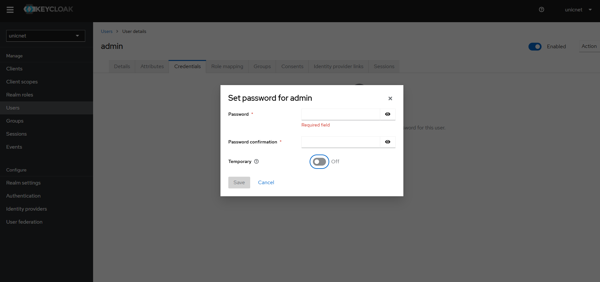

#### Добавление пользователя в группы

1. Перейдите на вкладку "Groups" созданного пользователя
2. Нажмите "Join Group"
3. Выберите и добавьте пользователя в следующие группы:
   - `unicnet_admin_group` - Пользователь с правами администратора. Имеет доступ к админ. панели Unicnet
   - `unicnet_superuser_group` - Суперпользователь
   - `unicnet_user_group` - Пользователь

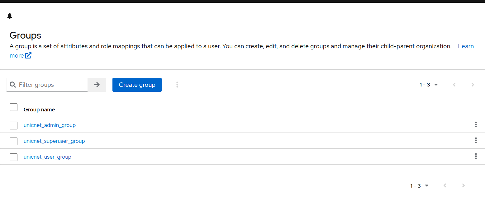

> **Примечание**: Группы уже созданы автоматически при импорте `unicnet-realm.json`. Вам нужно только добавить пользователя в существующие группы.

<!-- TOC --><a name="-restart-compose"></a>
### 12. Перезапуск Docker Compose

После выполнения всех настроек перезапустите все сервисы одной командой:

> **Примечание**: В зависимости от версии Docker Compose используйте:
> - `docker compose` (Docker Compose V2, встроен в Docker)
> - `docker-compose` (Docker Compose V1, отдельная утилита)

Определите, какая версия у вас установлена:

```bash
docker compose version
```

Если команда не работает, попробуйте:

```bash
docker-compose version
```

После определения версии выполните перезапуск:

**Для Docker Compose V2 (docker compose):**
```bash
cd app
docker compose -f docker-compose.yml down && docker compose -f docker-compose.yml up -d
```

**Для Docker Compose V1 (docker-compose):**
```bash
cd app
docker-compose -f docker-compose.yml down && docker-compose -f docker-compose.yml up -d
```

Эта команда:
- Останавливает и удаляет все контейнеры (`down`)
- Запускает все контейнеры заново в фоновом режиме (`up -d`)

Перезапуск необходим для применения всех изменений (пользователи MongoDB, секреты Vault, realm Keycloak).

<!-- TOC --><a name="-unicnet-2"></a>
### Проверка работы системы

После выполнения всех шагов проверьте работу системы:

#### Вход в UnicNet

По адресу `http://<SERVER_IP>:8080` будет доступна страница авторизации UnicNet (порт 8080 используется для Frontend):

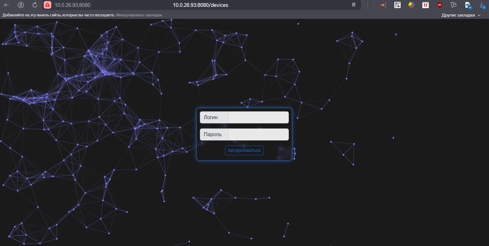

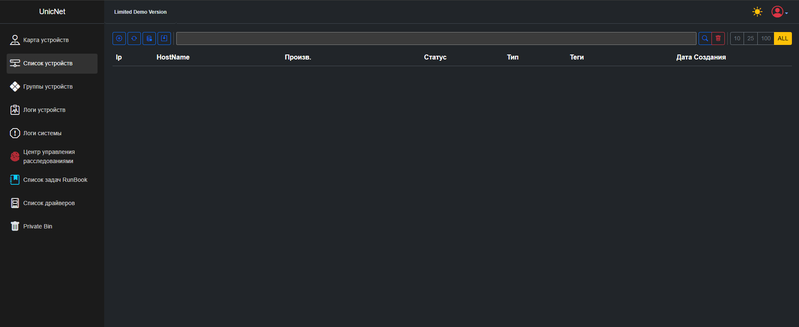

#### Проверка подключения к Swagger, KeyCloak

Зайдите в админ-панель в правом верхнем углу. Проверьте корректность подключения к Swagger и KeyCloak:

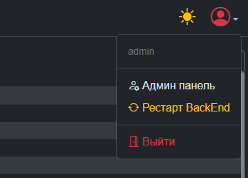

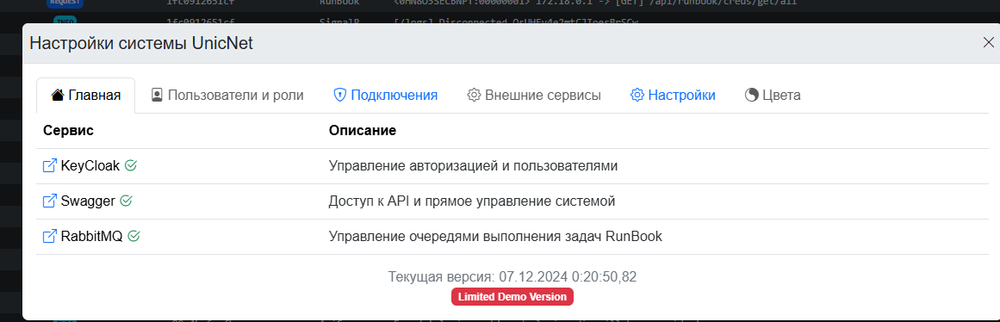

#### Создание подключений для SSH, TELNET, SNMP

Подключения — это учетные данные для авторизации на сетевых устройствах, необходимые для расширенного сбора информации о сетевых устройствах и работы автоматизированных задач Runbook. Для создания подключения заполните:

- Название
- Логин
- Пароль
- Суперпользователь (пароль суперпользователя, заполняется только для типа SSH)

> 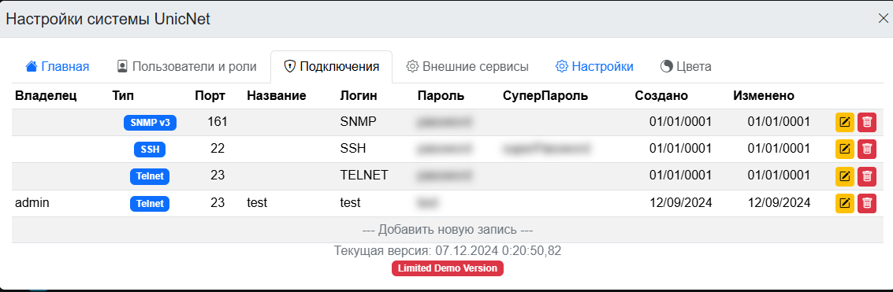
>
> 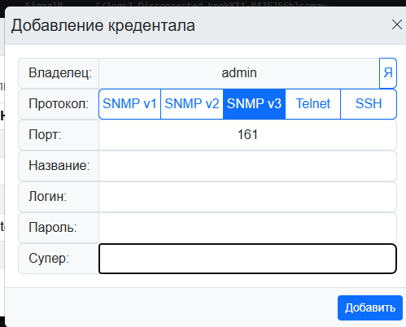

<!-- TOC --><a name="faq"></a>
## F.A.Q

1. **Шаг завершился с ошибкой HTTP 401 или проблемой с токенами**. Если какой-либо шаг (особенно шаги 6, 7, 10, 11, связанные с Keycloak или Vault) завершился с ошибкой HTTP 401 или проблемой получения токена, попробуйте запустить его повторно. Иногда сервисы (Keycloak, Vault) могут быть не полностью готовы при первом запросе после запуска или импорта realm. Просто выберите соответствующий пункт в меню скрипта еще раз - обычно повторный запуск решает проблему.

2. **Не создалась база данных в PostgreSQL при первом запуске**. Вы можете самостоятельно подключиться к PostgreSQL и создать необходимую базу данных:

   **Подключение к контейнеру PostgreSQL:**
   
   ```bash
   # Подключиться к контейнеру PostgreSQL
   docker exec -it unicnetpostgres /bin/bash
   ```
   
   Или выполнить команду напрямую без входа в контейнер:
   
   ```bash
   # Подключиться к базе данных PostgreSQL напрямую
   # Используйте переменные из export_variables.txt
   docker exec -it unicnetpostgres psql -U ${POSTGRES_USER:-unicnet} -d postgres
   ```
   
   **Просмотр всех баз данных:**
   
   ```bash
   # Из контейнера (если вы уже внутри)
   psql -U ${POSTGRES_USER:-unicnet} -d postgres -c "\l"
   
   # Или напрямую из терминала
   docker exec -it unicnetpostgres psql -U ${POSTGRES_USER:-unicnet} -d postgres -c "\l"
   ```
   
   В интерактивном режиме psql используйте команду:
   
   ```sql
   \l
   ```
   
   **Создание базы данных:**
   
   ```bash
   # Создать базу данных из терминала
   docker exec -it unicnetpostgres psql -U ${POSTGRES_USER:-unicnet} -d postgres -c "CREATE DATABASE ${POSTGRES_DB:-unicnetdb};"
   ```
   
   Или в интерактивном режиме psql:
   
   ```sql
   CREATE DATABASE unicnetdb;
   ```
   
   **Проверка существования базы данных:**
   
   ```bash
   # Проверить, существует ли база данных
   docker exec -it unicnetpostgres psql -U ${POSTGRES_USER:-unicnet} -d postgres -c "\l" | grep ${POSTGRES_DB:-unicnetdb}
   ```
   
   **Полезные команды psql:**
   
   ```sql
   \l          -- Список всех баз данных
   \c dbname  -- Подключиться к базе данных
   \dt        -- Список всех таблиц в текущей базе данных
   \du        -- Список всех пользователей
   \q         -- Выйти из psql
   ```
   
   > **Примечание**: Используйте переменные окружения из файла `export_variables.txt`:
   > - `POSTGRES_USER` - имя пользователя (по умолчанию: `unicnet`)
   > - `POSTGRES_DB` - имя базы данных (по умолчанию: `unicnetdb`)
   > - `POSTGRES_PASSWORD` - пароль пользователя

3. **Как удалить переменные окружения**. Для удаления переменных окружения используйте команду `unset`:

   ```bash
   # Удалить одну переменную
   unset POSTGRES_PASSWORD
   unset UniCommLicenseData
   
   # Удалить несколько переменных
   unset POSTGRES_DB POSTGRES_USER POSTGRES_PASSWORD
   
   # Удалить все переменные UnicNet одной командой
   unset POSTGRES_DB POSTGRES_USER POSTGRES_PASSWORD \
         MONGO_INITDB_ROOT_USERNAME MONGO_INITDB_ROOT_PASSWORD MONGO_INITDB_DATABASE \
         MONGO_UNICNET_DB MONGO_UNICNET_USER MONGO_UNICNET_PASSWORD \
         MONGO_LOGGER_DB MONGO_LOGGER_USER MONGO_LOGGER_PASSWORD \
         MONGO_VAULT_DB MONGO_VAULT_USER MONGO_VAULT_PASSWORD \
         KEYCLOAK_ADMIN_USER KEYCLOAK_ADMIN_PASSWORD UniCommLicenseData
   
   # Проверить, что переменная удалена
   echo $POSTGRES_PASSWORD
   # (должно быть пусто)
   ```

   > **Примечание**: Переменные окружения удаляются только из текущей сессии shell. После закрытия терминала они автоматически удаляются. Для постоянного удаления нужно также удалить их из файла `export_variables.txt` или из файла конфигурации shell (`.bashrc`, `.bash_profile` и т.д.).

4. **Как посмотреть логи всех сервисов**. Для просмотра логов каждого сервиса используйте следующие команды:

   ```bash
   # Логи конкретного контейнера
   docker logs unicnetbackend
   docker logs unicnetfrontend
   docker logs unicnetlogger
   docker logs unicnetvault
   docker logs unicnetsyslog
   docker logs unicnetrouter
   docker logs unicnetpostgres
   docker logs unicnetmongo
   docker logs unicnetkeycloak
   
   # Логи с отслеживанием в реальном времени (follow)
   docker logs -f unicnetbackend
   docker logs -f unicnetfrontend
   
   # Последние N строк логов
   docker logs --tail 100 unicnetbackend
   
   # Логи за последний час
   docker logs --since 1h unicnetbackend
   
   # Логи всех контейнеров unicnet
   docker ps --filter "name=unicnet" --format "{{.Names}}" | xargs -I {} sh -c 'echo "=== {} ===" && docker logs --tail 50 {}'
   ```

5. **Как посмотреть переменные окружения в контейнерах**. Для просмотра переменных окружения каждого контейнера:

   ```bash
   # Все переменные окружения конкретного контейнера
   docker exec unicnetbackend env
   docker exec unicnetfrontend env
   docker exec unicnetlogger env
   docker exec unicnetvault env
   docker exec unicnetsyslog env
   docker exec unicnetrouter env
   
   # Отсортированные переменные окружения
   docker exec unicnetbackend env | sort
   
   # Только переменные, связанные с лицензией
   docker exec unicnetbackend env | grep -i license
   
   # Все переменные всех контейнеров unicnet
   docker ps --filter "name=unicnet" --format "{{.Names}}" | xargs -I {} sh -c 'echo "=== {} ===" && docker exec {} env | sort'
   
   # Конкретная переменная из контейнера
   docker exec unicnetbackend sh -c 'echo $UniCommLicenseData'
   ```

6. **Проблемы с секретом в Vault**. Если у вас проблемы с секретом в Vault (например, секрет не создается или не читается), попробуйте удалить коллекцию в MongoDB:

   ```bash
   # Подключитесь к MongoDB контейнеру от пользователя vault_user
   docker exec -it unicnetmongo mongo vault_db -u ${MONGO_VAULT_USER:-vault_user} -p ${MONGO_VAULT_PASSWORD:-vault_pass_123} --authenticationDatabase vault_db
   
   # Просмотрите все коллекции
   show collections
   
   # Удалите коллекцию с секретами (коллекция называется "Secrets")
   db.Secrets.drop()
   
   # Выйдите из MongoDB
   exit
   ```

   После удаления коллекции перезапустите контейнер Vault:

   ```bash
   docker restart unicnetvault
   ```

   Затем создайте секрет заново (см. шаг 8 в разделе "Ручная установка").

7. **Как посмотреть пользователей в MongoDB**. Для просмотра всех пользователей в MongoDB:

   ```bash
   # Подключитесь к MongoDB контейнеру
   docker exec -it unicnetmongo mongo admin -u ${MONGO_INITDB_ROOT_USERNAME} -p ${MONGO_INITDB_ROOT_PASSWORD}
   
   # Просмотрите всех пользователей во всех базах данных
   db.getUsers()
   
   # Просмотрите пользователей конкретной базы данных
   use unicnet_db
   db.getUsers()
   
   # Или используйте команду для просмотра пользователей через admin базу
   use admin
   db.system.users.find().pretty()
   
   # Просмотрите пользователей для каждой базы данных
   use unicnet_db
   db.getUsers()
   
   use logger_db
   db.getUsers()
   
   use vault_db
   db.getUsers()
   
   # Выйдите из MongoDB
   exit
   ```

   Или одной командой из терминала:

   ```bash
   # Пользователи базы данных unicnet_db
   docker exec -it unicnetmongo mongo admin -u ${MONGO_INITDB_ROOT_USERNAME} -p ${MONGO_INITDB_ROOT_PASSWORD} --eval "db.getSiblingDB('unicnet_db').getUsers()"
   
   # Пользователи базы данных logger_db
   docker exec -it unicnetmongo mongo admin -u ${MONGO_INITDB_ROOT_USERNAME} -p ${MONGO_INITDB_ROOT_PASSWORD} --eval "db.getSiblingDB('logger_db').getUsers()"
   
   # Пользователи базы данных vault_db
   docker exec -it unicnetmongo mongo admin -u ${MONGO_INITDB_ROOT_USERNAME} -p ${MONGO_INITDB_ROOT_PASSWORD} --eval "db.getSiblingDB('vault_db').getUsers()"
   ```


