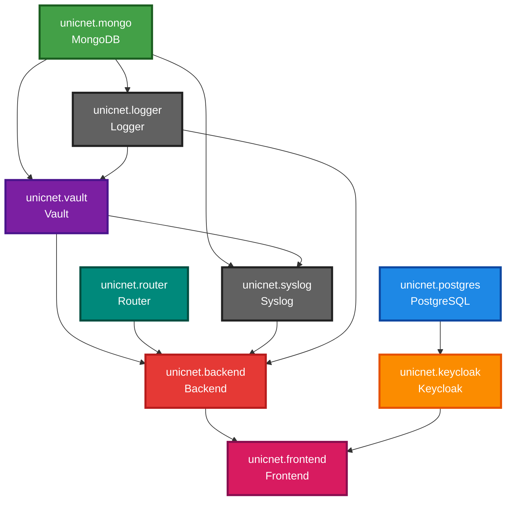

<!-- TOC start (generated with https://github.com/derlin/bitdowntoc) -->

- [Инструкция по установке и настройке Unicnet ](#-unicnet)
- [🚨 КРИТИЧЕСКИ ВАЖНО: ЛИЦЕНЗИЯ ОБЯЗАТЕЛЬНА ПЕРЕД УСТАНОВКОЙ](#-критически-важно-лицензия-обязательна-перед-установкой)
- [Архитектура установки](#-)
   * [Установка на 1-м сервере](#-1-)
   * [Зависимости сервисов](#-deps)
- [Автоматизированная установка с помощью скрипта](#--1)
   * [Шаги по использованию скрипта:](#--2)
- [Ручная установка](#--3)
   * [Порядок установки](#--4)
   * [Установка docker и docker-compose](#-docker-docker-compose)
   * [Подключение к репозиторию Unicnet](#-unicnet-1)
   * [Установка необходимых компонентов одним compose файлом](#-compose-)
      + [Создание docker сети для compose файла](#-docker-compose-)
   * [Удаление старого volume для unicnet.mongo](#-volume-unicnetmongo)
      + [Шаги по удалению Volume:](#-volume)
      + [Настройка переменных окружения](#--5)
      + [Запуск compose файла](#-compose--1)
   * [Настройка Keycloak](#-keycloak)
      + [Создание realm](#-realm)
      + [Создание пользователя](#-realm-2)
      + [Добавление пользователя в группы](#-realm-3)
   * [Настройка unicnet](#-unicnet-2)
      + [Перезапуск сервисов](#--6)
      + [Вход в unicnet](#-unicnet-3)
      + [Проверка подключения к Swagger, KeyCloak](#-unicnet-4)
      + [Создание подключений для SSH, TELNET, SNMP](#-unicnet-5)
- [F.A.Q](#faq)

<!-- TOC end -->


<!-- TOC --><a name="-unicnet"></a>
## Инструкция по установке и настройке Unicnet 

<div style="background-color: #ff0000; border: 4px solid #cc0000; padding: 20px; margin: 30px 0; border-radius: 8px; color: #ffffff; font-weight: bold;">

### 🚨 КРИТИЧЕСКИ ВАЖНО: ЛИЦЕНЗИЯ ОБЯЗАТЕЛЬНА ПЕРЕД УСТАНОВКОЙ

**⚠️ ВНИМАНИЕ! Перед началом установки UnicNet Enterprise ОБЯЗАТЕЛЬНО необходимо:**

1. **📋 Запросить лицензию** у поставщика или администратора системы
2. **⚙️ Установить лицензию** в переменную окружения `UniCommLicenseData` перед запуском Docker Compose
3. **✅ Проверить**, что лицензия корректно передана во все сервисы

**❌ БЕЗ ДЕЙСТВУЮЩЕЙ ЛИЦЕНЗИИ СИСТЕМА НЕ БУДЕТ РАБОТАТЬ КОРРЕКТНО!**

**Как установить лицензию:**

```bash
# Экспортируйте переменную окружения с лицензией
export UniCommLicenseData="ваша_лицензия_здесь"

# Или добавьте в файл export_variables.txt:
# export UniCommLicenseData="ваша_лицензия_здесь"
```

> **⚠️ ВАЖНО**: Лицензия используется всеми сервисами (Backend, Frontend, Logger, Syslog, Vault, Router). Убедитесь, что переменная `UniCommLicenseData` экспортирована перед запуском `docker-compose up`.

</div>

<!-- TOC --><a name="-"></a>
## Архитектура установки

<!-- TOC --><a name="-1-"></a>
### Установка на 1-м сервере


<!-- TOC --><a name="-deps"></a>
### Зависимости сервисов

Ниже представлена диаграмма зависимостей между сервисами UnicNet Enterprise. Стрелки показывают, какие сервисы зависят от других.



> **Примечание**: Диаграмма автоматически генерируется из `docker-compose.yml` с помощью скрипта `diagrams/generate_diagram.sh`. Для обновления диаграммы выполните: `cd diagrams && ./generate_diagram.sh`

**Уровни зависимостей:**

- **Уровень 0 (Базовые сервисы):** `unicnet.postgres`, `unicnet.mongo`
- **Уровень 1:** `unicnet.keycloak` → postgres, `unicnet.logger` → mongo
- **Уровень 2:** `unicnet.vault` → mongo, logger
- **Уровень 3:** `unicnet.syslog` → mongo, vault; `unicnet.router` → (нет зависимостей)
- **Уровень 4:** `unicnet.backend` → vault, router, syslog, logger
- **Уровень 5:** `unicnet.frontend` → backend, keycloak

**Порядок запуска сервисов:**

1. `unicnet.postgres` (PostgreSQL)
2. `unicnet.mongo` (MongoDB)
3. `unicnet.keycloak` (после postgres)
4. `unicnet.logger` (после mongo)
5. `unicnet.vault` (после mongo и logger)
6. `unicnet.syslog` (после mongo и vault)
7. `unicnet.router` (независимый сервис)
8. `unicnet.backend` (после vault, router, syslog и logger)
9. `unicnet.frontend` (после backend и keycloak)

> **Примечание**: Docker Compose автоматически учитывает зависимости через `depends_on` и запускает сервисы в правильном порядке.

<!-- TOC --><a name="--1"></a>
## Автоматизированная установка с помощью скрипта

Для упрощения процесса установки и настройки UnicNet Enterprise (версия 11.1) вы можете использовать интерактивный скрипт `install.sh`. 
Этот скрипт автоматизирует большинство шагов, описанных в разделе ручной установки, включая проверку зависимостей, клонирование репозитория, настройку переменных окружения, запуск Docker Compose, импорт realm в Keycloak, создание пользователя и назначение групп. Скрипт поддерживает uninstall/reinstall и генерирует безопасные пароли.

<!-- TOC --><a name="--2"></a>
### Шаги по использованию скрипта:

1. **Скачайте скрипт**: Сохраните файл `install.sh` в удобную директорию (например, в корневую папку установки).
2. **Сделайте скрипт исполняемым**:

   ```bash
   chmod +x install.sh
   ```
3. **Запустите скрипт**:

   ```bash
   ./install.sh
   ```
   - Скрипт соберёт необходимые входные данные (IP сервера, пароли и т.д.) интерактивно или загрузит из конфигурационного файла, если он существует.
   - Выберите опцию "0" для полной автоматической установки или отдельные шаги для ручного управления.
4. **После выполнения**: Проверьте итоговый вывод скрипта с URL и учётными данными. Если нужно, продолжите с ручными шагами из раздела "Ручная установка" (например, проверка подключений в UnicNet).

**Примечания**:
- Если скрипт завершится ошибкой, проверьте логи контейнеров и вернитесь к ручным шагам ниже.
- При повторном запуске скрипт использует конфигурационные данные из файла unicnet_installer.conf, созданного при первом запуске.

<!-- TOC --><a name="--3"></a>
## Ручная установка

<!-- TOC --><a name="--4"></a>
### Порядок установки

- установка docker и docker-compose
- создание Docker сети
- установка PostgreSQL (для Keycloak)
- установка MongoDB
- установка Keycloak
- установка сервисов UnicNet (Backend, Frontend, Logger, Vault, Syslog, Router)

<!-- TOC --><a name="-docker-docker-compose"></a>
### Установка docker и docker-compose

Установка производится за рамками инструкции. Рекомендуется установить docker с официального сайта https://docs.docker.com/engine/install/

<!-- TOC --><a name="-unicnet-1"></a>
### Подключение к репозиторию Unicnet

Образы UnicNet Enterprise находятся в Yandex Container Registry компании «ПРАВИЛЬНЫЙ СОФТ». 

**Актуальные образы:**
- PostgreSQL: `cr.yandex/crp39psc34hg49unp6p7/postgres:alpine3.15`
- MongoDB: `cr.yandex/crp39psc34hg49unp6p7/mongo:4.4`
- Keycloak: `cr.yandex/crp39psc34hg49unp6p7/keycloak:22.0.5`
- Backend: `cr.yandex/crpi5ll6mqcn793fvu9i/unic/unicnetbackend:prod`
- Frontend: `cr.yandex/crpi5ll6mqcn793fvu9i/unicnet.solid/prod:front251222`
- Logger: `cr.yandex/crpi5ll6mqcn793fvu9i/unic/uniclogger:prod`
- Vault: `cr.yandex/crpi5ll6mqcn793fvu9i/unic/unicvault:prod`
- Syslog: `cr.yandex/crpi5ll6mqcn793fvu9i/unic/unicnetsyslog:prod`
- Router: `cr.yandex/crpi5ll6mqcn793fvu9i/unic/unicnetrouter:prod`

Для подключения к реестру выполните команду в терминале:

```bash
echo y0_AgAAAAB3muX6AATuwQAAAAEawLLRAAB9TQHeGyxGPZXkjVDHF1ZNJcV8UQ | docker login \
--username oauth \
--password-stdin \
cr.yandex
```

> **Примечание**: Токен может быть изменен. Если команда не работает, запросите актуальный токен у администратора.

<!-- TOC --><a name="-compose-"></a>
### Установка необходимых компонентов одним compose файлом

Скачайте файлы с репозитория. Перейдите в директорию `./app` и найдите файлы:

- `docker-compose.yml` - Docker Compose файл со всеми сервисами
- `unicnet-realm.json` - конфигурация realm для Keycloak

> **Важно**: Файл `.env` не используется. Все переменные окружения задаются через `export` или файл `export_variables.txt` (см. раздел "Переменные окружения" выше).

<!-- TOC --><a name="-docker-compose-"></a>
#### Создание docker сети для compose файла

Создайте сеть командой:

```bash
docker network create unicnet_network
```

<!-- TOC --><a name="-volume-unicnetmongo"></a>
### Удаление старого volume для unicnet.mongo

Если вы ранее устанавливали unicnet на данном сервере с другими настройками для контейнера unicnet.mongo, настоятельно рекомендуется удалить старый volume. Пожалуйста, учтите, что это приведет к потере всех данных, хранящихся в unicnet.mongo.

<!-- TOC --><a name="-volume"></a>
#### Шаги по удалению Volume:

1. Показать список существующих Volume: Для отображения всех доступных volume выполните следующую команду:

   ```bash
   docker volume ls
   ```

2. Удалить старый Volume: После того как вы определитесь с необходимым volume, используйте следующую команду для его удаления:

   ```bash
   docker volume rm имя_вашего_volume
   ```

Убедитесь, что вы хотите удалить именно тот volume, который связан с unicnet.mongo, поскольку процесс удаления является необратимым и приведет к утрате всех данных.

<!-- TOC --><a name="--5"></a>
#### Настройка переменных окружения

> **Важно**: Файл `.env` не используется в проекте. Все переменные окружения задаются через `export` или файл `export_variables.txt` (см. раздел "Переменные окружения" выше).

<!-- TOC --><a name="-compose--1"></a>
#### Запуск compose файла

Скачайте образы командой:

```bash
cd app
docker compose -f docker-compose.yml pull
```

Создайте контейнеры командой:

```bash
docker compose -f docker-compose.yml up -d
```

Проверьте, что контейнеры:

- unicnet.postgres
- unicnet.mongo
- unicnet.keycloak
- unicnet.backend
- unicnet.frontend
- unicnet.logger
- unicnet.vault
- unicnet.syslog
- unicnet.router

корректно поднялись.

Проверьте логи контейнера:

```bash
docker logs container_name
```

<!-- TOC --><a name="-keycloak"></a>
### Настройка Keycloak

Откройте файл `unicnet-realm.json` на редактирование. Измените все значения `internal_IP` на ваш внутренний IP адрес.

> К примеру, ваш внутренний IP адрес 192.168.0.1. Замените все значения `internal_IP` на 192.168.0.1

<!-- TOC --><a name="-realm"></a>
#### Создание realm

Для входа в Keycloak используйте значения переменных окружения:

- `KEYCLOAK_ADMIN_USER` (по умолчанию: `unicnet`)
- `KEYCLOAK_ADMIN_PASSWORD` (по умолчанию: `admin123`)

Или прочитайте credentials из контейнера:
```bash
docker inspect unicnet.keycloak | grep -E "KEYCLOAK_ADMIN_USER|KEYCLOAK_ADMIN_PASSWORD"
```

Перейдите по адресу `http://<SERVER_IP>:8095`, чтобы увидеть страницу авторизации Keycloak.

Создайте новый realm из файла unicnet-realm.json:

#### Создание пользователя

Для входа в Unicnet создайте пользователя в Keycloak:


И задайте ему пароль:

#### Добавление пользователя в группы

> **Примечание**: Группы уже созданы автоматически при импорте `unicnet-realm.json`. Вам нужно только добавить пользователя в существующие группы.

На вкладке "Пользователи" выберите нужного пользователя. Затем перейдите в раздел "Группы" и добавьте пользователя в необходимые группы:

- `unicnet_admin_group` - Пользователь с правами администратора. Имеет доступ к админ. панели Unicnet
- `unicnet_superuser_group` - Суперпользователь
- `unicnet_user_group` - Пользователь


<!-- TOC --><a name="-unicnet-2"></a>
### Настройка unicnet

<!-- TOC --><a name="--6"></a>
#### Перезапуск сервисов

Перезапустите сервисы:

```bash
cd app
docker compose -f docker-compose.yml restart
```

Проверьте логи контейнеров:

- unicnet.postgres
- unicnet.mongo
- unicnet.keycloak
- unicnet.backend
- unicnet.frontend
- unicnet.logger
- unicnet.vault
- unicnet.syslog
- unicnet.router

```bash
docker logs container_name
```

<!-- TOC --><a name="-unicnet-3"></a>
#### Вход в unicnet

По адресу `http://<SERVER_IP>:8080` будет доступна страница авторизации UnicNet (порт 8080 используется для Frontend):


#### Проверка подключения к Swagger, KeyCloak

Зайдите в админ-панель в правом верхнем углу. Проверьте корректность подключения к Swagger и KeyCloak:


#### Создание подключений для SSH, TELNET, SNMP

Подключения — это учетные данные для авторизации на сетевых устройствах, необходимые для расширенного сбора информации о сетевых устройствах и работы автоматизированных задач Runbook. Для создания подключения заполните:

- Название
- Логин
- Пароль
- Суперпользователь (пароль суперпользователя, заполняется только для типа SSH)

> Суперпользователь (пароль суперпользователя, заполняется только для типа SSH)
>
> 
>
> 

<!-- TOC --><a name="faq"></a>
## F.A.Q

1. **Не создалась база данных в PostgreSQL при первом запуске**.Вы можете самостоятельно создать необходимую базу данных через контейнер. Просмотрите запущенные контейнеры. Выполните команду:

   ```bash
   docker ps
   ```

   Скопируйте `NAMES` контейнера PostgreSQL. Зайдите в контейнер PostgreSQL под root. Выполните команду:

   ```bash
   docker exec -u root -t -i 'container_name' /bin/bash
   ```

   Используя пользователя POSTGRES_USER, подключитесь к базе данных `postgres`. Выполните команду:

   ```bash
   psql -U <username> -d postgres
   ```

   Просмотрите список баз данных. Выполните команду:

   ```sql
   \l
   ```

   Если вашей базы данных нет, создайте её. Выполните команду:

   ```sql
   CREATE DATABASE dbname;
   ```


