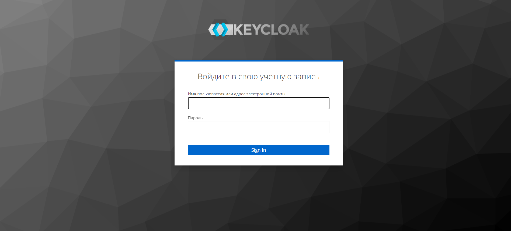
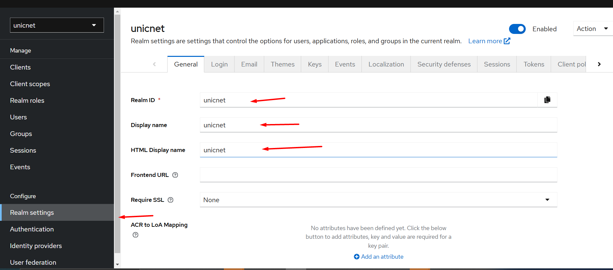
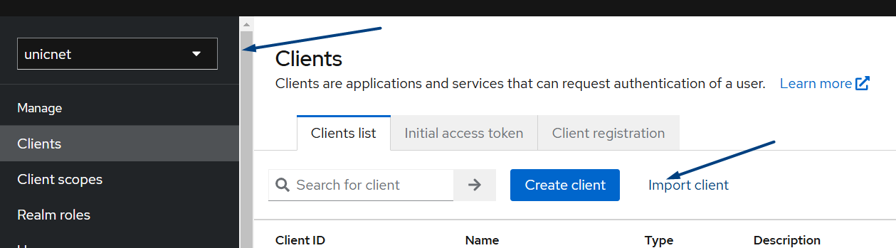
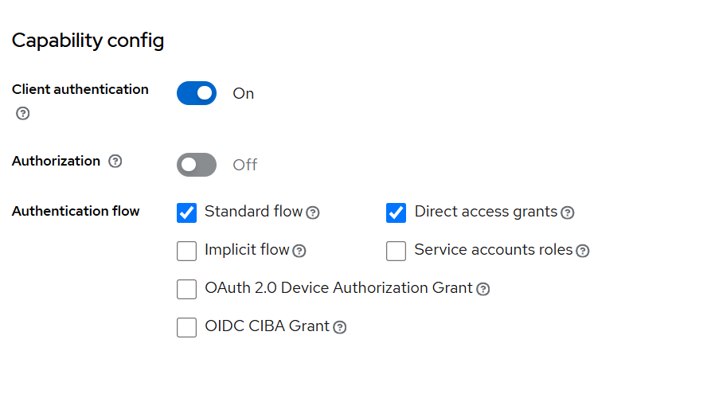

<!-- TOC start (generated with https://github.com/derlin/bitdowntoc) -->

- [Инструкция по установке и настройке Unicnet в одном контейнере ](#-unicnet-)
   * [Архитектура установки](#-)
      + [Установка на 1-м сервере](#-1-)
   * [Порядок установки <a name="docker"></a>](#--1)
   * [Установка docker и docker-compose <a name="docker"></a>](#-docker-docker-compose)
   * [Подключение к репозиторию yandex container registry <a name="yc"></a>](#-yandex-container-registry)
   * [Установка необходимых компонентов одним compose файлом <a name="install_all_components"></a>](#-compose-)
      + [Создание docker сети для compose файла <a name="create_network"></a>](#-docker-compose-)
      + [Создание compose файла <a name="create_compose"></a>](#-compose--1)
      + [Настройка переменных окружения <a name=".env"></a>](#--2)
      + [Запуск keycloak<a name="keycloak_start"></a>](#-keycloak)
   * [Настройка Keycloack <a name="KeyCloak_settings"></a>](#-keycloack)
      + [Создание realm <a name="create_realm"></a>](#-realm)
      + [Создайте нового клиента для realm <a name="create_client"></a>](#-realm-1)
      + [Генерация секрета](#--3)
      + [Создание пользователя <a name="create_user"></a>](#--4)
   * [Настройка unicnet <a name="unicnet_settings"></a> ](#-unicnet)
      + [Настройка переменных окружения для unicnet.solid  <a name="external_un.solid"></a>](#-unicnetsolid)
   * [Вход в unicnet <a name="unicnetauth"></a>](#-unicnet-1)
   * [F.A.Q <a name="faq"></a>](#faq)

<!-- TOC end -->


<!-- TOC --><a name="-unicnet-"></a>
## Инструкция по установке и настройке Unicnet в одном контейнере 


<!-- TOC --><a name="-"></a>
### Архитектура установки
<!-- TOC --><a name="-1-"></a>
#### Установка на 1-м сервере

<!-- TOC --><a name="--1"></a>
### Порядок установки <a name="docker"></a>
 * установка docker
 * установка rabbitMQ
 * установка postgres
 * установка postgres-exporter
 * установка keycloak
 * установка mongodb
 * установка unicnet

<!-- TOC --><a name="-docker-docker-compose"></a>
### Установка docker и docker-compose <a name="docker"></a>
Установка производится за рамками инструкции  
Рекомендуется установить docker с официального сайта https://docs.docker.com/engine/install/
<!-- TOC --><a name="-yandex-container-registry"></a>
### Подключение к репозиторию yandex container registry <a name="yc"></a>
Образы unicnet лежат в yandex container registry компании Unicomm. Для подключения к нему выполните команду в терминале 
``` bash
echo y0_AgAAAAB3muX6AATuwQAAAAEawLLRAAB9TQHeGyxGPZXkjVDHF1ZNJcV8UQ | sudo docker login \
--username oauth \
--password-stdin \
cr.yandex
```

<!-- TOC --><a name="-compose-"></a>
### Установка необходимых компонентов одним compose файлом <a name="install_all_components"></a>

Скачайте файлы из директории ./app  
* .env
* unicnet.solid.env
* unicnet_all_in_one.yml  

Разместите их в одной директории
<!-- TOC --><a name="-docker-compose-"></a>
#### Создание docker сети для compose файла <a name="create_network"></a>
Создайте сеть командой
``` yml
docker network create unicnet_network
```
<!-- TOC --><a name="-compose--1"></a>
#### Создание compose файла <a name="create_compose"></a>
Отредактируйте unicnet_all_in_one.yml
+
``` yml
version: "3"
services:
  rabbitmq.unicomm:
    image: "rabbitmq:3.10.7-management"
    container_name: rabbitmq_unicomm
    restart: always
    ports:
      - "15672:15672"
      - "5672:5672"
      - "4369:4369"
      - "25672:25672"
    volumes:
      - ./rabbit/rabbit-unicomm.conf:/etc/rabbitmq/rabbitmq.config
    environment:
      RABBITMQ_DEFAULT_USER: ${RABBITMQ_DEFAULT_USER} 
      RABBITMQ_DEFAULT_PASS: ${RABBITMQ_DEFAULT_PASS} 
    env_file:
      - ".env"
    networks:
      - unicnet_network
    depends_on:
      - postgres
  postgres:
    container_name: postgres
    image: postgres:alpine3.15
    command:
      - "postgres"
      - "-c"
      - "max_connections=50"
      - "-c"
      - "shared_buffers=1GB"
      - "-c"
      - "effective_cache_size=4GB"
      - "-c"
      - "work_mem=16MB"
      - "-c"
      - "maintenance_work_mem=512MB"
      - "-c"
      - "random_page_cost=1.1"
      - "-c"
      - "temp_file_limit=10GB"
      - "-c"
      - "log_min_duration_statement=200ms"
      - "-c"
      - "idle_in_transaction_session_timeout=10s"
      - "-c"
      - "lock_timeout=1s"
      - "-c"
      - "statement_timeout=60s"
      - "-c"
      - "shared_preload_libraries=pg_stat_statements"
      - "-c"
      - "pg_stat_statements.max=10000"
      - "-c"
      - "pg_stat_statements.track=all"
    environment:
       POSTGRES_DB: ${POSTGRES_DB} 
       POSTGRES_USER: ${POSTGRES_USER} 
       POSTGRES_PASSWORD: ${POSTGRES_PASSWORD} 
       PGDATA: "/var/lib/postgresql/data/pgdata"
    env_file:
      - ".env"
    volumes:
      - .:/var/lib/postgresql/data
    ports:
      - "5432:5432"
    healthcheck:
      test: ["CMD-SHELL", "pg_isready -U ${POSTGRES_USER} -d ${POSTGRES_DB}"]
      interval: 10s
      timeout: 5s
      retries: 5
      start_period: 10s
    restart: unless-stopped
    deploy:
      resources:
        limits:
          cpus: "1"
          memory: 4G
    networks:
      - unicnet_network

  postgres_exporter:
    container_name: exporter_container
    image: prometheuscommunity/postgres-exporter:v0.10.0
    environment:
      DATA_SOURCE_URI: "postgres:5432/${POSTGRES_DB}?sslmode=disable"
      DATA_SOURCE_USER: ${POSTGRES_USER}
      DATA_SOURCE_PASS: ${POSTGRES_PASSWORD}
      PG_EXPORTER_EXTEND_QUERY_PATH: "/etc/postgres_exporter/queries.yaml"
    env_file:
      - ".env"
    volumes:
      - ./queries.yaml:/etc/postgres_exporter/queries.yaml:ro
    ports:
      - "9187:9187"
    restart: unless-stopped
    deploy:
      resources:
        limits:
          cpus: "0.2"
          memory: 500M
    networks:
      - unicnet_network
    depends_on:
      - postgres

  mongodb_container:
    container_name: un.mongo.solid
    restart: always
    image: mongo:4.4
    environment:
      MONGO_INITDB_ROOT_USERNAME: ${MONGO_INITDB_ROOT_USERNAME}
      MONGO_INITDB_ROOT_PASSWORD: ${MONGO_INITDB_ROOT_PASSWORD}
      MONGO_INITDB_DATABASE: ${MONGO_INITDB_DATABASE}
    env_file:
      - ".env"
    ports:
      - 27017:27017
    volumes:
      - mongodb_data_container:/data/db
    networks:
      - unicnet_network

  keycloak:
    container_name: unicnet_keycloak
    image: bitnami/keycloak:22.0.5
    environment:
      KEYCLOAK_USER: ${KEYCLOAK_USER}
      KEYCLOAK_PASSWORD: ${KEYCLOAK_PASSWORD}
      KEYCLOAK_ADMIN: ${KEYCLOAK_ADMIN}
      KEYCLOAK_ADMIN_PASSWORD: ${KEYCLOAK_ADMIN_PASSWORD}
      KEYCLOAK_DATABASE_HOST: postgres
      KEYCLOAK_DATABASE_PORT: 5432
      KEYCLOAK_DATABASE_NAME: ${KEYCLOAK_DATABASE_NAME}
      KEYCLOAK_DATABASE_USER: ${KEYCLOAK_DATABASE_USER}
      KEYCLOAK_DATABASE_PASSWORD: ${KEYCLOAK_DATABASE_PASSWORD}
      KEYCLOAK_DATABASE_SCHEMAL: "public"
      KEYCLOAK_JDBC_PARAMS: "sslmode=disable&connectTimeout=30000"
      # Dev Configuration in order to access in HTTP mode
      KEYCLOAK_HOSTNAME_STRICT: "false"
      #deactivate fixed hostname
      KEYCLOAK_HOSTNAME_STRICT_HTTPS: "false"
      #For local access to console admin in start mode
      KEYCLOAK_HTTP_ENABLED: "true"
    env_file:
      - ".env"
    ports:
      - "8095:8080"
      - "8096:8443"
      - "9990:9990"
    restart: unless-stopped
    networks:
      - unicnet_network
    depends_on:
      - postgres
  unicnet.solid.core:
    image: cr.yandex/crpi5ll6mqcn793fvu9i/unicnet.solid/prod:back241127 # вставьте вашу версию
    container_name: unicnet.solid
    ports:
      - "30111:8080"
    env_file:
      - "./unicnet.solid.env"
    restart: unless-stopped
    networks:
      - unicnet_network
    depends_on:
      - keycloak
      - mongodb_container
  uniwebui:
    image: cr.yandex/crpi5ll6mqcn793fvu9i/unicnet.solid/prod:front241127 # вставьте вашу версию
    environment:
      Uc.BackHost: http://$${Uc.BackHost}:30111/ #Адрес swagger (def: http://{Uc.BackHost}:30111/)
      Uc.BackHostSW: http://$${Uc.BackHostSW}:30111/swagger/index.html #Адрес swagger web (def: {Uc.BackHostSW}swagger/index.html)
      Uc.BackHostKC: http://$${Uc.BackHostKC}:8095/  #Адрес KeyCloak (def: http://{Uc.BackHostKC}:8095/)
      Uc.BackHostRMQ: http://$${Uc.BackHostRMQ}:15672/#/queue #Адрес rabbitMQ (def: http://{Uc.BackHostKC}:15672/#/queue
      Uc.BackIp: $${Uc.BackIp} #ваш адрес сервера
    env_file:
      - ".env"
    ports:
      - "8080:8080"
      - "8081:8081"
    restart: unless-stopped
    networks:
      - unicnet_network
volumes:
  mongodb_data_container:

networks:
  unicnet_network:
    driver: bridge
    external: true


```
<!-- TOC --><a name="--2"></a>
#### Настройка переменных окружения <a name=".env"></a>
Отредактируйте `.env` файл из директории ./app/.env 

<!-- TOC --><a name="-keycloak"></a>
#### Запуск keycloak<a name="keycloak_start"></a>
 Скачайте образы командой 
``` yml
docker compose -f 'путь до файла.yml' pull
 
```
Создайте контейнеры командой
``` yml
docker compose -f 'путь до файла.yml' up -d
 
```
Проверьте логи контейнера
 
``` yml
docker compose -f 'путь до файла.yml' logs
```

Проверьте что контейнеры 
 * rabbitMQ
 * postgres
 * postgres-exporter
 * keycloak
 * mongodb
корректно поднялись
 
<!-- TOC --><a name="-keycloack"></a>
### Настройка Keycloack <a name="KeyCloak_settings"></a>

<!-- TOC --><a name="-realm"></a>
#### Создание realm <a name="create_realm"></a>
 Для входа в keycloak воспользуйтесь значением переменных для сервиса keycloak из файла unicnet_all_in_one.yml 
 * KEYCLOAK_ADMIN: 
 * KEYCLOAK_ADMIN_PASSWORD: 

 Перейдите по настроенному адресу, используя маппинг порта из файла unicnet_all_in_one.yml (8095) чтобы увидеть страницу авторизации keycloak.


Создайте новый realm 

Заполните значения для realm
Создайте новый realm 


<!-- TOC --><a name="-realm-1"></a>
#### Создайте нового клиента для realm <a name="create_client"></a>
Создайте клиента для нового realm 

Укажите для следующих настроек клиента ваш адрес подключения к unicnet.solid в формате http://внутренний_ip:port(в случае этой инструкции http://внутренний_ip:30111) 
* Root URL
* Home URL
* Web origins
* Admin URL 

Укажите для следующих настроек ваш адрес подключения к unicnet.solid в формате http://внутренний_ip:port/* (в случае этой инструкции http://внутренний_ip:30111/*)
* Valid post logout redirect URIs
* Valid redirect URIs

Включите для `Capability config` значения 
* Client authentication
* Standard flow
* irect access grants 
 
 
<!-- TOC --><a name="--3"></a>
#### Генерация секрета
Сгенерируйте в разделе `credentials`  `Client secret` 

 
<!-- TOC --><a name="--4"></a>
#### Создание пользователя <a name="create_user"></a>
 Для входа в unicnet создайте пользователя в keycloak.
 
 Для этого воспользуйтесь значением из переменных файла keycloak.yml
 * KEYCLOAK_ADMIN: 
 * KEYCLOAK_ADMIN_PASSWORD: 
 
Перейдите по настроенному адресу, используя маппинг порта из файла unicnet_all_in_one.yml (8095) чтобы увидеть страницу авторизации keycloak.


 Создайте пользователя
 


 И задайте ему пароль
 

<!-- TOC --><a name="-unicnet"></a>
### Настройка unicnet <a name="unicnet_settings"></a> 

<!-- TOC --><a name="-unicnetsolid"></a>
#### Настройка переменных окружения для unicnet.solid  <a name="external_un.solid"></a>

Отредактируйте переменные окружения в `./app/unicnet.solid.env` файле.
* Mongo
* RabbitMq
* CredentialEntry.guid
* LoginPassEntry.ваш_логин
* UnPlugList
* UniVaultToken
* UnKc.Authority
* UnKc.AurhUrl
* UnKc.TokenUrl
* UnKc.Audience
* UnKc.Realm 
* UnKc.ClientId
* UnKc.ClientSecret

Примечание
> UnInit. может быть от 0 до 100

> UnKc. - Настройка KeyCloak для авторизации сваггера

> UnPlugList - Список подгружаемых плагинов или *

> UniVaultToken - токен для UniVault
 
Перезапустите сервисы

``` yml  

docker compose -f 'путь до файла.yml' down && docker compose -f 'путь до файла.yml' up -d
 
```
Проверьте логи контейнеров
 
``` yml
docker compose -f 'путь до файла.yml' logs
```

<!-- TOC --><a name="-unicnet-1"></a>
### Вход в unicnet <a name="unicnetauth"></a>
Возьмите из файла unicnet_all_in_one.yml порт закрепленный для 8080, port:8080. По адресу развёртывания webui на этому порту будет доступна страница авторизации UnicNet.


<!-- TOC --><a name="faq"></a>
### F.A.Q
1. Не создалась база данных в postgresql при первом запуске.
Вы можете  самостоятельно создать необходимую базу данных через контейнер.
Просмотрите запущенные контейнеры. Выполните команду:
``` yml
docker ps  
```
Скопируйте `NAMES` контейнера postgresql
Зайдите в контейнер postgres под root. Выполните команду
``` bash
docker exec -u root -t -i 'container_name' /bin/bash
```
Используя пользователя POSTGRES_USER, подключитесь к базе данных `postgres`. Выполните команду
``` bash
psql -U <username>   -d postgres
```
Просмотрите список бд. Выполните команду
``` sql
\l
```
Если вашей бд нет, создайте её. Выполните команду
``` sql
CREATE DATABASE dbname;
```
