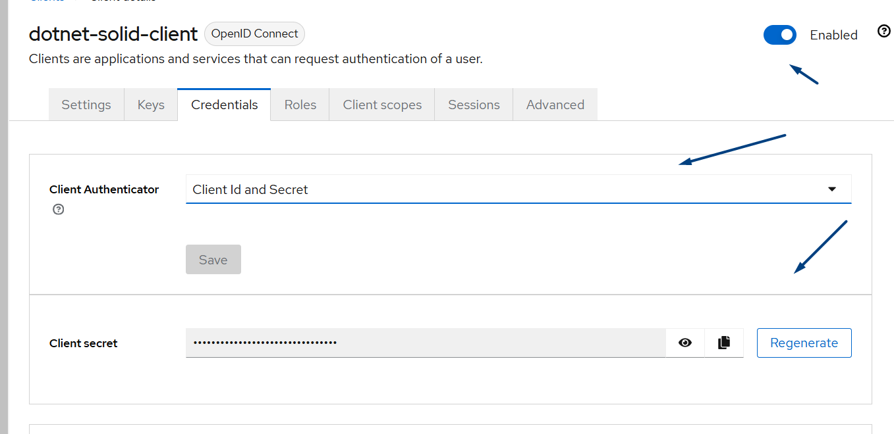

<!-- TOC start (generated with https://github.com/derlin/bitdowntoc) -->

- [Инструкция по установке и настройке Unicnet ](#-unicnet)
- [Архитектура установки](#-)
   * [Установка на 1-м сервере](#-1-)
- [Автоматизированная установка с помощью скрипта](#--1)
   * [Шаги по использованию скрипта:](#--2)
- [Ручная установка](#--3)
   * [Порядок установки](#--4)
   * [Установка docker и docker-compose](#-docker-docker-compose)
   * [Подключение к репозиторию Unicnet](#-unicnet-1)
   * [Установка необходимых компонентов одним compose файлом](#-compose-)
      + [Создание docker сети для compose файла](#-docker-compose-)
   * [Удаление старого volume для unicnet.mongo](#-volume-unicnetmongo)
      + [Шаги по удалению Volume:](#-volume)
      + [Настройка переменных окружения](#--5)
      + [Запуск compose файла](#-compose--1)
   * [Настройка Keycloak](#-keycloak)
      + [Создание realm](#-realm)
   * [Настройка unicnet](#-unicnet-2)
      + [Перезапуск сервисов](#--6)
      + [Вход в unicnet](#-unicnet-3)
- [F.A.Q](#faq)

<!-- TOC end -->


<!-- TOC --><a name="-unicnet"></a>
## Инструкция по установке и настройке Unicnet 

<!-- TOC --><a name="-"></a>
## Архитектура установки

<!-- TOC --><a name="-1-"></a>
### Установка на 1-м сервере


<!-- TOC --><a name="--1"></a>
## Автоматизированная установка с помощью скрипта

Для упрощения процесса установки и настройки UnicNet Enterprise (версия 11.1) вы можете использовать интерактивный скрипт `install.sh`. 
Этот скрипт автоматизирует большинство шагов, описанных в разделе ручной установки, включая проверку зависимостей, клонирование репозитория, подготовку `.env`, запуск Docker Compose, импорт realm в Keycloak, создание пользователя и назначение групп. Скрипт поддерживает uninstall/reinstall и генерирует безопасные пароли.

<!-- TOC --><a name="--2"></a>
### Шаги по использованию скрипта:

1. **Скачайте скрипт**: Сохраните файл `install.sh` в удобную директорию (например, в корневую папку установки).
2. **Сделайте скрипт исполняемым**:

   ```bash
   chmod +x install.sh
   ```
3. **Запустите скрипт**:

   ```bash
   ./install.sh
   ```
   - Скрипт соберёт необходимые входные данные (IP сервера, пароли и т.д.) интерактивно или загрузит из конфигурационного файла, если он существует.
   - Выберите опцию "0" для полной автоматической установки или отдельные шаги для ручного управления.
4. **После выполнения**: Проверьте итоговый вывод скрипта с URL и учётными данными. Если нужно, продолжите с ручными шагами из раздела "Ручная установка" (например, проверка подключений в UnicNet).

**Примечания**:
- Если скрипт завершится ошибкой, проверьте логи контейнеров и вернитесь к ручным шагам ниже.
- При повторном запуске скрипт использует конфигурационные данные из файла unicnet_installer.conf, созданного при первом запуске.

<!-- TOC --><a name="--3"></a>
## Ручная установка

<!-- TOC --><a name="--4"></a>
### Порядок установки

- установка docker
- установка rabbitMQ
- установка postgres
- установка postgres-exporter
- установка keycloak
- установка mongodb
- установка unicnet

<!-- TOC --><a name="-docker-docker-compose"></a>
### Установка docker и docker-compose

Установка производится за рамками инструкции. Рекомендуется установить docker с официального сайта https://docs.docker.com/engine/install/

<!-- TOC --><a name="-unicnet-1"></a>
### Подключение к репозиторию Unicnet

Образы Unicnet лежат в Yandex Container Registry компании «ПРАВИЛЬНЫЙ СОФТ». Для подключения к нему выполните команду в терминале:

```bash
echo y0_AgAAAAB3muX6AATuwQAAAAEawLLRAAB9TQHeGyxGPZXkjVDHF1ZNJcV8UQ | sudo docker login \
--username oauth \
--password-stdin \
cr.yandex
```

<!-- TOC --><a name="-compose-"></a>
### Установка необходимых компонентов одним compose файлом

Скачайте файлы с репозитория. Перейдите в директорию `./app` и найдите файлы:

- .env
- unicnet-realm.json
- unicnet_all_in_one.yml

Разместите их в одной директории.

<!-- TOC --><a name="-docker-compose-"></a>
#### Создание docker сети для compose файла

Создайте сеть командой:

```bash
docker network create unicnet_network
```

<!-- TOC --><a name="-volume-unicnetmongo"></a>
### Удаление старого volume для unicnet.mongo

Если вы ранее устанавливали unicnet на данном сервере с другими настройками для контейнера unicnet.mongo, настоятельно рекомендуется удалить старый volume. Пожалуйста, учтите, что это приведет к потере всех данных, хранящихся в unicnet.mongo.

<!-- TOC --><a name="-volume"></a>
#### Шаги по удалению Volume:

1. Показать список существующих Volume: Для отображения всех доступных volume выполните следующую команду:

   ```bash
   docker volume ls
   ```

2. Удалить старый Volume: После того как вы определитесь с необходимым volume, используйте следующую команду для его удаления:

   ```bash
   docker volume rm имя_вашего_volume
   ```

Убедитесь, что вы хотите удалить именно тот volume, который связан с unicnet.mongo, поскольку процесс удаления является необратимым и приведет к утрате всех данных.

<!-- TOC --><a name="--5"></a>
#### Настройка переменных окружения

При необходимости отредактируйте скачанный `.env` файл, установите свои значения в:

- BASE_USER=unicnet
- BASE_PASS=unicnet
- DATA_BASE=unicnet_db
- PDB_PORT=5432

> Вы можете оставить эти значения по умолчанию

<!-- TOC --><a name="-compose--1"></a>
#### Запуск compose файла

Скачайте образы командой:

```bash
docker compose -f 'путь до файла.yml' pull
```

Создайте контейнеры командой:

```bash
docker compose -f 'путь до файла.yml' up -d
```

Проверьте, что контейнеры:

- unicnet.postgres
- unicnet.keycloak
- unicnet.postgres.exporter
- unicnet.rabbitmq
- unicnet.mongo
- unicnet.backend
- unicnet.frontend

корректно поднялись.

Проверьте логи контейнера:

```bash
docker logs container_name
```

<!-- TOC --><a name="-keycloak"></a>
### Настройка Keycloak

Откройте файл `unicnet-realm.json` на редактирование. Измените все значения `internal_IP` на ваш внутренний IP адрес.

> К примеру, ваш внутренний IP адрес 192.168.0.1. Замените все значения `internal_IP` на 192.168.0.1

<!-- TOC --><a name="-realm"></a>
#### Создание realm

Для входа в Keycloak воспользуйтесь значениями переменных для сервиса Keycloak из файла `.env`:

- KEYCLOAK_ADMIN
- KEYCLOAK_ADMIN_PASSWORD

Перейдите по настроенному адресу, используя маппинг порта из файла unicnet_all_in_one.yml (8095), чтобы увидеть страницу авторизации Keycloak.

Создайте новый realm из файла unicnet-realm.json:

#### Генерация секрета

Для вашего `UnKc.ClientId` из `.env` файла сгенерируйте в разделе `credentials` `Client secret` и вставьте его в `UnKc.ClientSecret` вашего `.env`.

#### Создание пользователя

Для входа в Unicnet создайте пользователя в Keycloak:


И задайте ему пароль:

#### Добавление пользователя в группы

На вкладке "Пользователи" выберите нужного пользователя. Затем перейдите в раздел "Группы" и добавьте пользователя в необходимые группы:

- unicnet_admin_group - Пользователь с правами администратора. Имеет доступ к админ. панели Unicnet
- unicnet_superuser_group - Суперпользователь
- unicnet_user_group - Пользователь

  

<!-- TOC --><a name="-unicnet-2"></a>
### Настройка unicnet

<!-- TOC --><a name="--6"></a>
#### Перезапуск сервисов

Перезапустите сервисы:

```bash
docker compose -f 'путь до файла.yml' down && docker compose -f 'путь до файла.yml' up -d
```

Проверьте логи контейнеров:

- unicnet.postgres
- unicnet.keycloak
- unicnet.postgres.exporter
- unicnet.rabbitmq
- unicnet.mongo
- unicnet.backend
- unicnet.frontend

```bash
docker logs container_name
```

<!-- TOC --><a name="-unicnet-3"></a>
#### Вход в unicnet

Скопируйте из файла unicnet_all_in_one.yml порт, закрепленный за 8080 (port:8080). По адресу развертывания web UI на этом порту будет доступна страница авторизации UnicNet:


#### Проверка подключения к RabbitMQ, Swagger, KeyCloak

Зайдите в админ-панель в правом верхнем углу. Проверьте корректность подключения к RabbitMQ, Swagger, KeyCloak:


#### Создание подключений для SSH, TELNET, SNMP

Подключения — это учетные данные для авторизации на сетевых устройствах, необходимые для расширенного сбора информации о сетевых устройствах и работы автоматизированных задач Runbook. Для создания подключения заполните:

- Название
- Логин
- Пароль
- Суперпользователь (пароль суперпользователя, заполняется только для типа SSH)

> Суперпользователь (пароль суперпользователя, заполняется только для типа SSH)
>
> 
>
> 

<!-- TOC --><a name="faq"></a>
## F.A.Q

1. **Не создалась база данных в PostgreSQL при первом запуске**.Вы можете самостоятельно создать необходимую базу данных через контейнер. Просмотрите запущенные контейнеры. Выполните команду:

   ```bash
   docker ps
   ```

   Скопируйте `NAMES` контейнера PostgreSQL. Зайдите в контейнер PostgreSQL под root. Выполните команду:

   ```bash
   docker exec -u root -t -i 'container_name' /bin/bash
   ```

   Используя пользователя POSTGRES_USER, подключитесь к базе данных `postgres`. Выполните команду:

   ```bash
   psql -U <username> -d postgres
   ```

   Просмотрите список баз данных. Выполните команду:

   ```sql
   \l
   ```

   Если вашей базы данных нет, создайте её. Выполните команду:

   ```sql
   CREATE DATABASE dbname;
   ```


